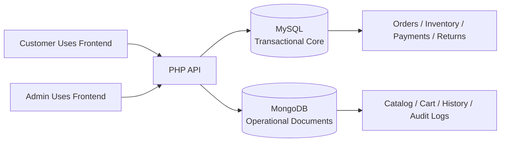
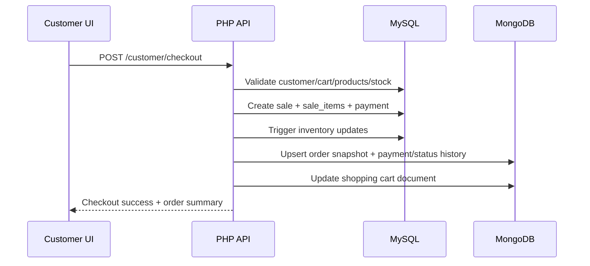
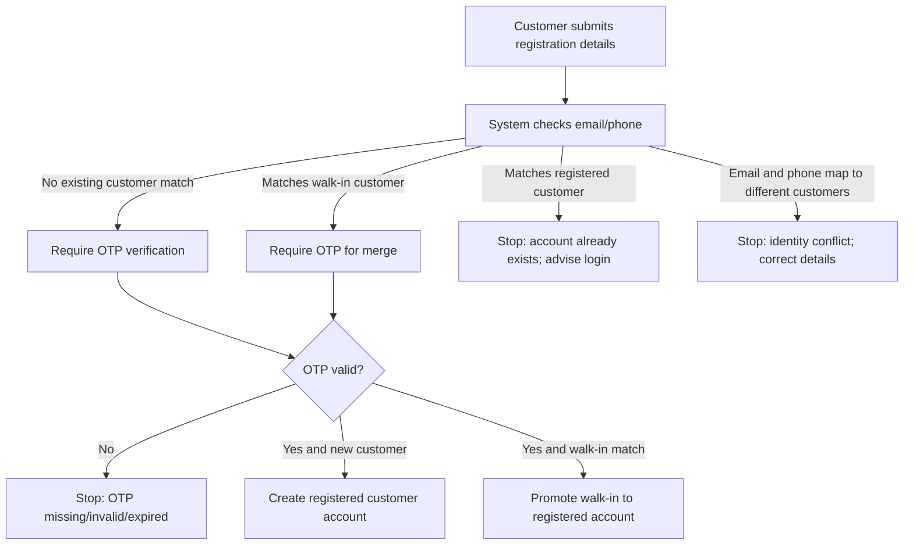
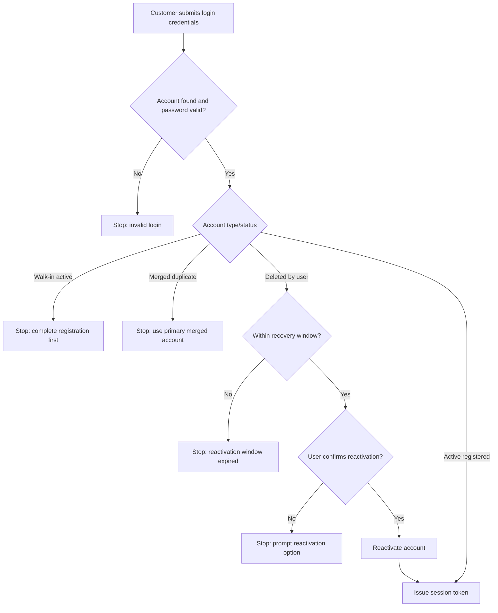
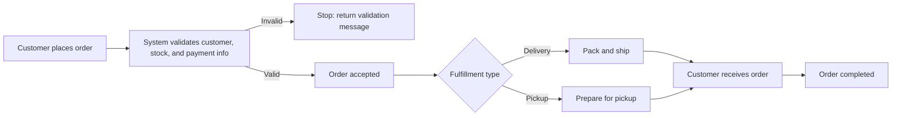
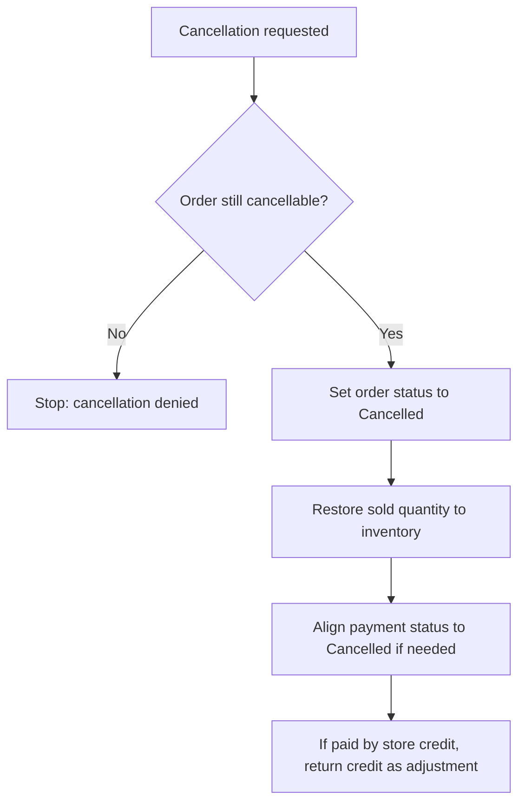
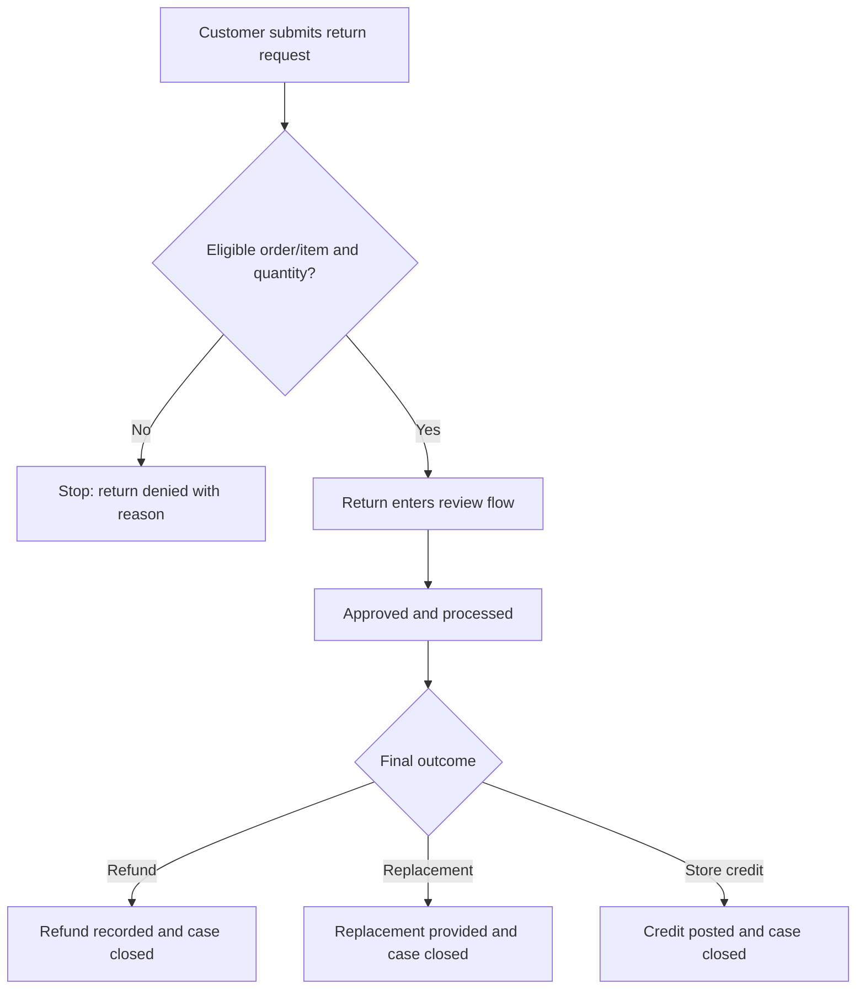
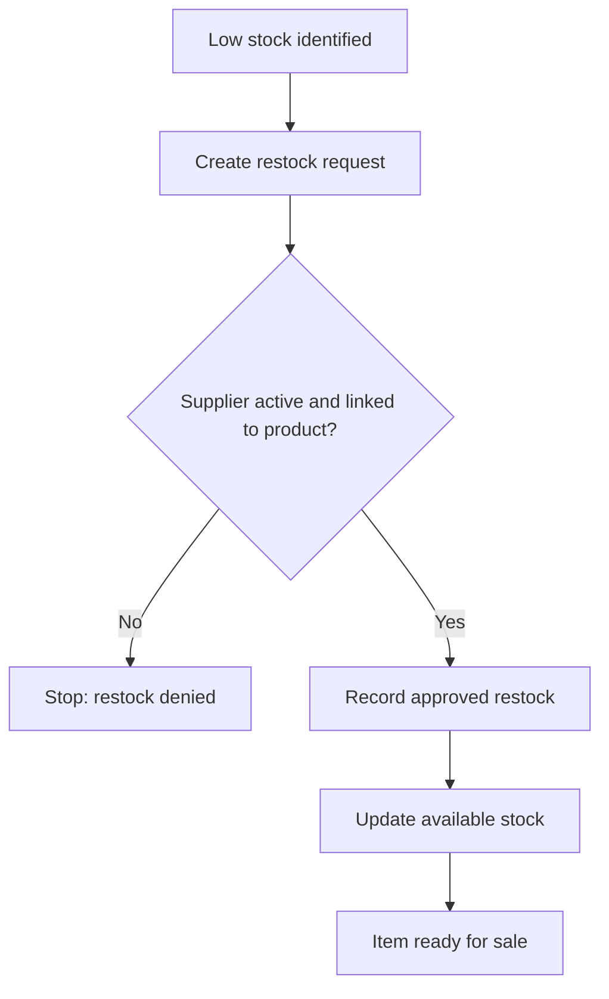
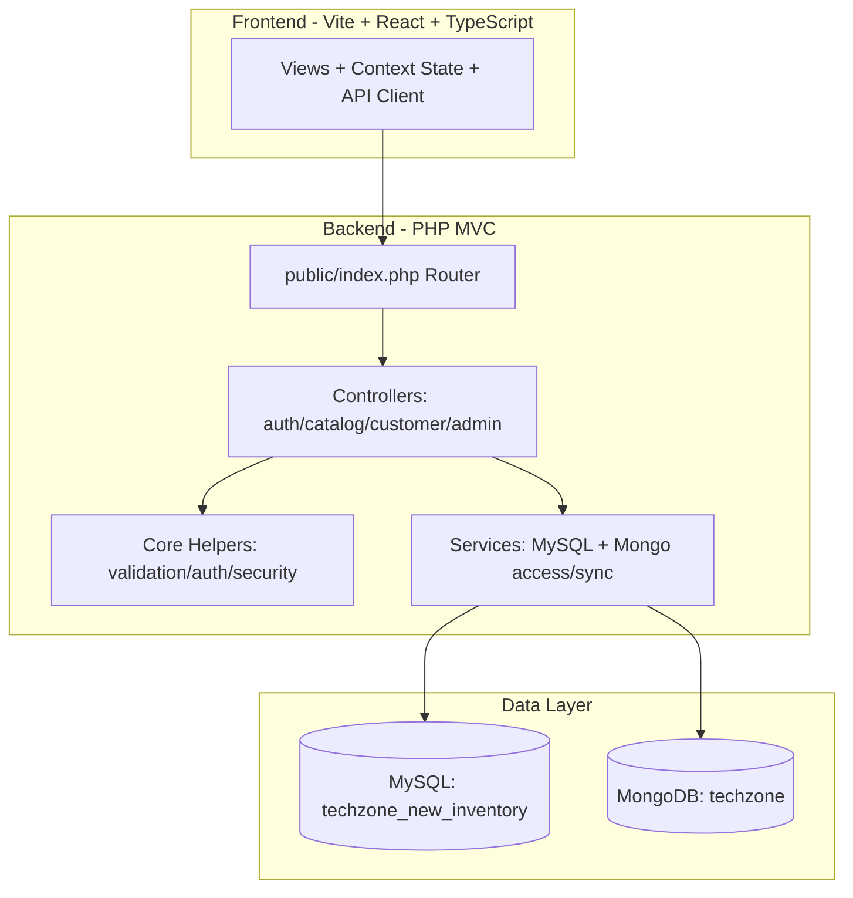
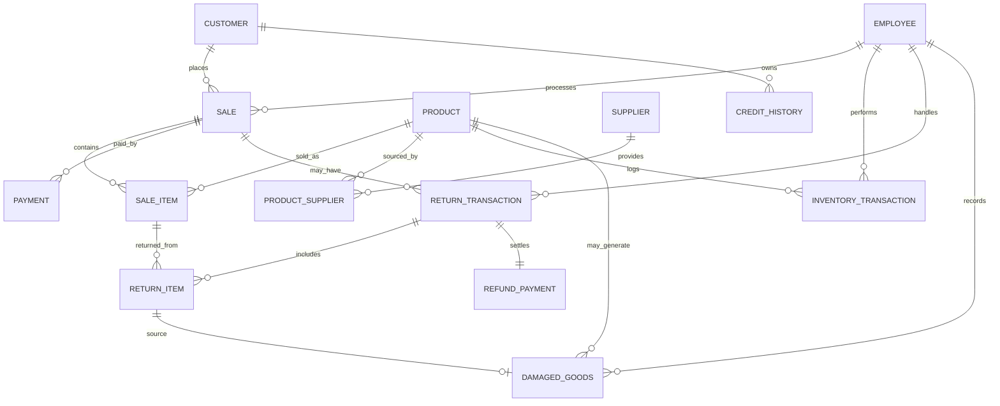

<div align="center">

# TechZone 2.0

<br><br><br>

**Group 1 - Atomic 7**  
Chavez, Amiel Diamond C.  
Garcia, Ashton Brian S.  
Lopez, John Christian Z.  
Mandac, Gian S.  
Nacalaban, Chelsea Hillary M.  
Nollen, Elijah Crisehea M.

<br><br>

**BSCS-SF241**

<br><br>

**February 26, 2026**

</div>

---

## Table of Contents
- [Document Control](#document-control)
- [Scope](#scope)
- [A. Non-Technical Documentation](#a-non-technical-documentation)
  - [A1. System Overview](#a1-system-overview)
  - [A2. System Objectives](#a2-system-objectives)
  - [A3. Target Users](#a3-target-users)
  - [A4. System Features](#a4-system-features)
  - [A5. System Workflow](#a5-system-workflow)
  - [A6. User Manual](#a6-user-manual)
  - [A7. Business Rules (Comprehensive, Non-Technical)](#a7-business-rules-comprehensive-non-technical)
    - [A7.1 Customer Identity and Account Lifecycle Rules](#a71-customer-identity-and-account-lifecycle-rules)
    - [A7.2 Registration and Duplicate-Handling Business Rules (Explicit Scenarios)](#a72-registration-and-duplicate-handling-business-rules-explicit-scenarios)
    - [A7.3 Checkout and Order Management Rules](#a73-checkout-and-order-management-rules)
    - [A7.4 Return and Refund Rules](#a74-return-and-refund-rules)
    - [A7.5 Product, Supplier, and Inventory Governance Rules](#a75-product-supplier-and-inventory-governance-rules)
    - [A7.6 Error Handling Matrix (Business-Friendly)](#a76-error-handling-matrix-business-friendly)
  - [A8. Business Process Flowcharts (Non-Technical)](#a8-business-process-flowcharts-non-technical)
    - [A8.1 Customer Registration and Walk-in Merge Flow (With Errors)](#a81-customer-registration-and-walk-in-merge-flow-with-errors)
    - [A8.2 Customer Login and Reactivation Decision Flow](#a82-customer-login-and-reactivation-decision-flow)
    - [A8.3 Order-to-Fulfillment Process](#a83-order-to-fulfillment-process)
    - [A8.4 Order Cancellation and Reversal Flow](#a84-order-cancellation-and-reversal-flow)
    - [A8.5 Return-to-Resolution Process](#a85-return-to-resolution-process)
    - [A8.6 Replenishment and Stock Control Process](#a86-replenishment-and-stock-control-process)
- [B. Technical Documentation](#b-technical-documentation)
  - [B1. System Architecture](#b1-system-architecture)
  - [B2. Technology Stack](#b2-technology-stack)
  - [B3. Project Structure](#b3-project-structure)
    - [B3.1 Directory Layout (Key Folders)](#b31-directory-layout-key-folders)
- [C. Database Documentation](#c-database-documentation)
  - [C1. Database Overview](#c1-database-overview)
  - [C2. ER Diagram (MySQL)](#c2-er-diagram-mysql)
  - [C3. Relationship Matrix](#c3-relationship-matrix)
  - [C4. Data Dictionary (Relational)](#c4-data-dictionary-relational)
  - [C5. MongoDB Collection Dictionary](#c5-mongodb-collection-dictionary)
  - [C6. Database Tables Description](#c6-database-tables-description)
  - [C7. Views](#c7-views)
  - [C8. Stored Procedures](#c8-stored-procedures)
  - [C9. Triggers](#c9-triggers)
  - [C10. Functions](#c10-functions)
  - [C11. Check Constraints](#c11-check-constraints)
  - [C12. Indexes](#c12-indexes)
  - [C13. Detailed SQL Object Specifications](#c13-detailed-sql-object-specifications)
    - [C13.1 View Specifications (Detailed)](#c131-view-specifications-detailed)
    - [C13.2 Stored Procedure Contract Registry (All Procedures)](#c132-stored-procedure-contract-registry-all-procedures)
    - [C13.3 Stored Procedure Logic and Rule Summary (Operational)](#c133-stored-procedure-logic-and-rule-summary-operational)
    - [C13.4 Function Specifications (Detailed)](#c134-function-specifications-detailed)
    - [C13.5 Trigger Specifications (Detailed)](#c135-trigger-specifications-detailed)
- [D. System Modules (Code Modules)](#d-system-modules-code-modules)
  - [D1. Backend Modules](#d1-backend-modules)
  - [D2. Frontend Modules](#d2-frontend-modules)
  - [D3. Maintenance/Operations Scripts](#d3-maintenanceoperations-scripts)
- [E. API / Backend Logic](#e-api--backend-logic)
  - [E1. Authentication and Authorization Model](#e1-authentication-and-authorization-model)
  - [E2. Endpoint Catalog](#e2-endpoint-catalog)
  - [E3. Core Backend Logic Highlights](#e3-core-backend-logic-highlights)
- [F. Security Implementation](#f-security-implementation)
- [G. Testing Documentation](#g-testing-documentation)
  - [G1. Current Testing State](#g1-current-testing-state)
  - [G2. Test Strategy](#g2-test-strategy)
  - [G3. Manual Test Cases (Sample Baseline)](#g3-manual-test-cases-sample-baseline)
    - [G3.1 Test Accounts (Local QA)](#g31-test-accounts-local-qa)
  - [G4. API Smoke Check Examples](#g4-api-smoke-check-examples)
- [H. Deployment Setup](#h-deployment-setup)
  - [H1. Deployment Modes (Local Development)](#h1-deployment-modes-local-development)
  - [H2. Prerequisites and Installation](#h2-prerequisites-and-installation)
  - [H3. Environment Variables (Detailed)](#h3-environment-variables-detailed)
  - [H4. MySQL Setup (Critical Import Order)](#h4-mysql-setup-critical-import-order)
  - [H5. MongoDB Setup (Database and Collections)](#h5-mongodb-setup-database-and-collections)
  - [H6. Post-Import Sync and Backfill Sequence](#h6-post-import-sync-and-backfill-sequence)
  - [H7. Start Services and Application](#h7-start-services-and-application)
  - [H8. Initial Access Verification](#h8-initial-access-verification)

---

# TechZone Application & Database Documentation

## Document Control
| Item | Value |
|---|---|
| System | TechZone (Customer Portal + Admin ERP) |
| Codebase Root | `C:\xampp\htdocs\techzone` |
| Version | 1.0 |
| Last Updated | 2026-02-26 |
| Prepared From | Actual source code, SQL schema, Mongo schema files |

## Scope
This document combines non-technical and technical documentation for the TechZone system, including application behavior, architecture, backend logic, and full database documentation (MySQL + MongoDB).

---

## A. Non-Technical Documentation

### A1. System Overview
TechZone is a hybrid e-commerce and ERP platform for computer hardware retail operations.

- Customer side:
  - Browse products
  - Manage cart and checkout
  - Track orders
  - Submit returns
  - Write product reviews
  - Submit customer inquiries
- Admin/back-office side:
  - Monitor dashboard KPIs
  - Manage products, pricing, stock, and suppliers
  - Process sales and order status changes
  - Handle returns/refunds
  - Manage users/customers
  - View activity logs

### A2. System Objectives
| Objective | Why it matters |
|---|---|
| Unify store operations and online ordering | Removes duplicate work between front office and back office |
| Preserve inventory accuracy | Prevents overselling and improves fulfillment reliability |
| Standardize order and return workflows | Ensures consistent customer experience and auditable operations |
| Provide traceability via audit logs | Supports accountability and issue investigation |
| Support both transactional data and document-based history | Uses MySQL for core integrity and MongoDB for flexible operational views/history |

### A3. Target Users
| User Group | Typical Tasks | Access |
|---|---|---|
| Guest customer | Browse products, view catalog | Public frontend |
| Registered customer | Login, checkout, track orders, profile, returns, inquiries, reviews | Customer portal |
| Employee | Update orders, process returns, inventory adjustments | Admin portal (`employee` role) |
| Administrator | Full operational controls incl. catalog, users, suppliers, sales, logs | Admin portal (`admin` role) |

### A4. System Features
| Area | Key Features |
|---|---|
| Authentication | Customer registration (with precheck + OTP verification), customer/admin login, role-based access |
| Catalog | Product listing from Mongo catalog enriched with MySQL stock/pricing |
| Cart/Checkout | Guest cart merge, per-item cart controls, checkout with payment and fulfillment method |
| Orders | Timeline status, mark received, cancel order, status synchronization to Mongo history |
| Returns/Refunds | Customer return request, admin return processing, refund payment handling |
| Customer Support | Inquiry submission and admin reply workflow |
| Inventory | Stock adjustments, restock workflow, transaction logs |
| Auditability | Admin/customer audit logs in MongoDB |

### A5. System Workflow

#### High-Level Workflow


#### Checkout Workflow


### A6. User Manual

#### Customer Manual
1. Open customer portal (`http://localhost:5173/`).
2. Register account:
   - Fill profile and address
   - Provide OTP code
3. Login (email or contact number + password).
4. Browse products in Shop and add items to cart.
5. Review cart and choose items to checkout.
6. During checkout, choose:
   - Fulfillment: `Delivery` or `Pickup`
   - Payment method: `Cash`, `GCash`, `Card`, `Store Credit`
7. Track order in **My Orders**.
8. For delivered/completed items:
   - Submit product review
   - Submit return request if needed
9. Update profile/password in **Profile**.
10. Submit concerns in **Contact**.

#### Admin Manual
1. Open admin portal (`http://localhost:5173/?portal=admin`).
2. Login using admin/employee credentials.
3. Use dashboard for KPIs and current activity.
4. Manage:
   - Products: create/update/price/stock/status/supplier links
   - Orders: status transitions + tracking/courier info
   - Sales: manual sale recording
   - Returns: approve/reject/finalize and refund handling
   - Users/Customers/Suppliers
5. Check inventory transactions and audit logs for traceability.

### A7. Business Rules (Comprehensive, Non-Technical)
This section lists business rules in plain English based on current live system behavior.  
It is written for business owners, QA, operations, and support teams.

#### A7.1 Customer Identity and Account Lifecycle Rules
| Rule | What it means in operations | If not met |
|---|---|---|
| At least one contact method is required | Every customer must have either an email or a mobile number. | Registration/update is blocked. |
| Contact information must be valid | Email and phone must be in accepted format before account actions continue. | User receives validation errors and cannot proceed. |
| Two customer types exist | `Walk-in` = in-store profile without online password. `Registered` = online login-enabled profile. | Walk-in customers cannot log in until registration is completed. |
| Registration always checks for existing identity | Email/phone are checked before creating a new online account. | Duplicate/conflicting identity is blocked. |
| Walk-in to registered conversion requires OTP | If identity matches an existing walk-in record, OTP verification is required to merge and promote it to registered. | Without valid OTP, conversion is denied. |
| OTP success upgrades customer type | After successful OTP merge, customer record becomes login-enabled registered account. | Account stays walk-in if OTP fails or is missing. |
| Existing registered account cannot be re-registered | If email/phone already belongs to a registered account, new registration is not allowed. | User is instructed to log in instead of creating a duplicate. |
| Mixed-identity conflict is blocked | If provided email belongs to one person and phone belongs to another, registration/merge is stopped. | User gets conflict guidance and must correct identity data. |
| Self-deactivated account has limited recovery | User-deleted accounts can be reactivated only within a recovery window (7 days). | After the window, reactivation is denied. |
| Merged duplicate accounts cannot be reactivated | Accounts already merged into a primary profile are not reactivated separately. | User must use the active primary account. |

#### A7.2 Registration and Duplicate-Handling Business Rules (Explicit Scenarios)
| Scenario | Business outcome |
|---|---|
| New customer with unused email/phone + valid OTP | New registered account is created. |
| Email/phone matches active walk-in record + valid OTP | Existing walk-in record is merged/promoted to registered customer. |
| Email/phone matches walk-in record but OTP missing/invalid/expired | Registration is blocked until valid OTP is provided. |
| Email or phone already used by an existing registered customer | Registration is blocked; user must log in to existing account. |
| Email and phone map to different customer records | Registration is blocked to prevent identity collision. |

#### A7.3 Checkout and Order Management Rules
| Rule | What it means in operations | If not met |
|---|---|---|
| Order can only include valid selectable items | Cart lines must be valid, quantity within allowed bounds, and product must still be sellable. | Checkout is blocked with stock/product message. |
| Delivery requires complete shipping details | Recipient name, address fields, and contact details must be complete for delivery orders. | Checkout is blocked until complete. |
| Deactivated online customers cannot place online orders | Only active customer accounts can continue online checkout. | Checkout is blocked. |
| Fulfillment path controls status options | Pickup and delivery orders follow different allowed status paths. | Invalid status change is rejected. |
| Status progression is controlled | Orders cannot jump backward from protected states; completed/cancelled are final. | Update is rejected. |
| Customer cancellation is limited to early states | Customer can cancel only while order is still in early processing stages. | Cancellation is denied in late/fulfilled states. |
| Cancellation triggers operational reversals | Cancelled orders trigger inventory return and payment status alignment. | System auto-applies reversal actions for consistency. |

#### A7.4 Return and Refund Rules
| Rule | What it means in operations | If not met |
|---|---|---|
| Returns are allowed only for eligible order states | Return requests are accepted only after fulfillment reaches eligible states. | Return request is denied. |
| Return quantity cannot exceed what was purchased | Requested quantity must be within purchased and remaining returnable quantity. | Return request is denied. |
| Duplicate return requests for same item are prevented | One active return flow per sale item context is enforced. | New request is blocked. |
| Return progress must follow allowed transitions | Requested, approved, in-process, rejected, finalized transitions are controlled. | Invalid transition is rejected. |
| Finalized return needs final outcome | Final state must be one of refund, replacement, or store credit. | Finalization is denied. |
| Financial closure is mandatory when applicable | Refund/store credit results must be recorded with corresponding financial entries. | Return cannot be considered properly closed. |

#### A7.5 Product, Supplier, and Inventory Governance Rules
| Rule | What it means in operations | If not met |
|---|---|---|
| Product pricing must remain valid | Selling price cannot be invalid and should not violate procurement cost rules. | Price change is rejected. |
| Product with stock cannot be deactivated | Items still on hand must be depleted first before deactivation. | Status change is rejected. |
| Restock requires valid authorized links | Restock requires a valid employee, valid product, and active linked supplier. | Restock is denied. |
| Inventory cannot go negative | Any sale/adjustment/return operation must keep stock non-negative. | Transaction is blocked. |
| Every stock movement must be traceable | Sale, restock, return, replacement, and cancellation movements are logged. | Operation is considered invalid/incomplete. |
| Supplier master data must stay unique/usable | Supplier identity and contact details must meet required uniqueness and format rules. | Create/update is rejected. |

#### A7.6 Error Handling Matrix (Business-Friendly)
| Process | Error Situation | User-facing outcome | Business handling intent |
|---|---|---|---|
| Registration | Email already used by registered customer | "Account already exists" guidance | Prevent duplicate registered identities |
| Registration | Phone already used by registered customer | "Account already exists" guidance | Prevent duplicate registered identities |
| Registration | Email and phone belong to different customers | Conflict error | Stop accidental cross-account merge |
| Registration/merge | OTP missing/invalid/expired for walk-in merge | OTP required/invalid error | Protect identity takeover risk |
| Login | Walk-in record tries to log in | "Walk-in only, complete registration first" | Enforce upgrade to registered flow |
| Login | Deactivated account outside recovery window | Reactivation denied | Enforce account recovery policy |
| Checkout | Delivery info incomplete | Field-specific validation errors | Ensure successful fulfillment |
| Checkout | Product inactive/out of stock | Stock/product validation error | Prevent oversell and failed orders |
| Order status update | Invalid status transition | Status update rejected | Preserve lifecycle integrity |
| Returns | Return exceeds purchased quantity | Quantity validation error | Prevent over-refund abuse |
| Returns | Invalid return transition/final outcome | Transition/finalization error | Ensure auditable closure |

### A8. Business Process Flowcharts (Non-Technical)

#### A8.1 Customer Registration and Walk-in Merge Flow (With Errors)


#### A8.2 Customer Login and Reactivation Decision Flow


#### A8.3 Order-to-Fulfillment Process


#### A8.4 Order Cancellation and Reversal Flow


#### A8.5 Return-to-Resolution Process


#### A8.6 Replenishment and Stock Control Process


---
## B. Technical Documentation

### B1. System Architecture


### B2. Technology Stack
| Layer | Technology |
|---|---|
| Frontend runtime | React 19 + TypeScript |
| Frontend tooling | Vite 7, ESLint, TailwindCSS |
| Backend runtime | PHP 8.1+ (recommended 8.2) |
| Backend architecture | Lightweight MVC-style (single entrypoint + controller files) |
| Relational DB | MySQL 8 (InnoDB) |
| Document DB | MongoDB Community |
| Web server | Apache (XAMPP) with rewrite to `public/index.php` |
| API auth | JWT (HMAC SHA-256) via custom token helper |

### B3. Project Structure
| Path | Responsibility |
|---|---|
| `README.md` | Project overview and quick-start instructions |
| `backend/public/index.php` | API entrypoint, CORS, routing, error handling |
| `backend/app/Controllers/*.php` | Endpoint handlers and use-case orchestration |
| `backend/app/Core/common.php` | Core utilities (env, JSON I/O, auth utils, validation, headers) |
| `backend/app/Core/helpers.php` | API helper functions and Mongo sync helpers |
| `backend/app/Models/services.php` | DB connectors, queries, Mongo operations, maintenance |
| `backend/.env` / `backend/.env.example` | Runtime configuration and environment variable template |
| `backend/techzone_old_inventory.sql` | Legacy source dataset used as migration/input source |
| `backend/techzone_new_inventory.sql` | Current MySQL schema + views + procedures + triggers + functions |
| `backend/mongodb_collection_schemas/*.json` | Mongo JSON schema definitions |
| `backend/scripts/*.php` | Operational maintenance scripts (sync/backfill/rebuild) |
| `frontend/src/controllers/TechzoneContext.tsx` | State container + API integration logic |
| `frontend/src/views` | Customer/admin UI views |
| `docs/Application_Database_Documentation.md` | Full application and database documentation |

#### B3.1 Directory Layout (Key Folders)
```text
techzone/
  backend/
    app/
      Controllers/
      Core/
      Models/
    mongodb_collection_schemas/
    public/
    scripts/
    .env
    .env.example
    techzone_old_inventory.sql
    techzone_new_inventory.sql
  frontend/
    src/
      controllers/
      models/
      views/
  docs/
    Application_Database_Documentation.md
```

---

## C. Database Documentation

### C1. Database Overview
TechZone uses a hybrid data architecture:

- MySQL (`techzone_new_inventory`)
  - Source of truth for transactional consistency
  - Enforces referential integrity, constraints, and business rules
- MongoDB (`techzone`)
  - Operational document read models:
    - product catalog
    - shopping cart
    - order and return history
    - inquiries
    - audit logs

### C2. ER Diagram (MySQL)


### C3. Relationship Matrix
| Parent | Child | Relationship | FK |
|---|---|---|---|
| `customer` | `sale` | 1-to-many | `sale.customerID` |
| `employee` | `sale` | 1-to-many (nullable) | `sale.employeeID` |
| `sale` | `sale_item` | 1-to-many | `sale_item.saleID` |
| `product` | `sale_item` | 1-to-many | `sale_item.productID` |
| `supplier` | `product_supplier` | many-to-many bridge | `product_supplier.supplierID` |
| `product` | `product_supplier` | many-to-many bridge | `product_supplier.productID` |
| `product` | `inventory_transaction` | 1-to-many | `inventory_transaction.productID` |
| `employee` | `inventory_transaction` | 1-to-many | `inventory_transaction.employeeID` |
| `customer` | `credit_history` | 1-to-many | `credit_history.customerID` |
| `sale` | `payment` | 1-to-many | `payment.saleID` |
| `sale` | `return_transaction` | 1-to-many | `return_transaction.saleID` |
| `employee` | `return_transaction` | 1-to-many | `return_transaction.employeeID` |
| `return_transaction` | `return_item` | 1-to-many | `return_item.returnID` |
| `sale_item` | `return_item` | 1-to-many | `return_item.sale_itemID` |
| `return_transaction` | `refund_payment` | 1-to-1 | `refund_payment.returnID` |
| `return_item` | `damaged_goods` | 1-to-many (nullable FK on child) | `damaged_goods.return_itemID` |

### C4. Data Dictionary (Relational)
Field columns below use:
- `Required`: `Yes` means `NOT NULL`
- `Key`: `PK`, `FK`, `UK`, or `-`

#### `customer`
| Attribute | Contents / Purpose | Type | Format / Allowed Values | Range / Rules | Required | Key | FK Referenced Table |
|---|---|---|---|---|---|---|---|
| `customerID` | Internal customer surrogate ID | INT AUTO_INCREMENT | Integer | Positive identity | Yes | PK | - |
| `public_id` | External customer identifier | VARCHAR(20) | e.g., `CS-XXXXXXXXXX` | Unique | Yes | UK | - |
| `first_name` | Given name | VARCHAR(50) | Human name | Non-empty | Yes | - | - |
| `last_name` | Family name | VARCHAR(50) | Human name | Non-empty | Yes | - | - |
| `middle_name` | Middle name | VARCHAR(50) | Optional text | Nullable | No | - | - |
| `customer_type` | Registration category | ENUM | `Walk-in`,`Registered` | Default `Walk-in` | Yes | - | - |
| `password_hash` | Login password hash | VARCHAR(255) | Password hash | Required for registered login | No | - | - |
| `status` | Account state | ENUM | `Active`,`Merged`,`Deleted_by_User` | Controlled by logic/procedures | Yes | - | - |
| `deleted_at` | Soft-delete timestamp | DATETIME | UTC datetime | Null unless deactivated/merged | No | - | - |
| `email_address` | Login/contact email | VARCHAR(100) | Lowercased email | Regex validated, unique with `deleted_at` | No | UK(composite) | - |
| `current_credit` | Store credit balance | DECIMAL(10,2) | Currency | `>=0` | Yes | - | - |
| `contact_number` | Mobile phone | VARCHAR(12) | `63XXXXXXXXXX` | Regex validated, unique with `deleted_at` | No | UK(composite) | - |
| `street_address` | Street line | VARCHAR(45) | Text | Nullable | No | - | - |
| `barangay` | Barangay | VARCHAR(45) | Text | Non-empty | Yes | - | - |
| `province` | Province | VARCHAR(45) | Text | Nullable | No | - | - |
| `city_municipality` | City/municipality | VARCHAR(45) | Text | Non-empty | Yes | - | - |
| `zip_code` | Postal code | VARCHAR(4) | `NNNN` | Regex `^[0-9]{4}$` | No | - | - |
| `created_at` | Creation timestamp | DATETIME | Timestamp | Default current time | Yes | - | - |
| `updated_at` | Last update timestamp | DATETIME | Timestamp | Auto-updated | Yes | - | - |

#### `product`
| Attribute | Contents / Purpose | Type | Format / Allowed Values | Range / Rules | Required | Key | FK Referenced Table |
|---|---|---|---|---|---|---|---|
| `productID` | Internal product ID | INT AUTO_INCREMENT | Integer | Positive identity | Yes | PK | - |
| `public_id` | Public product ID | VARCHAR(20) | e.g., `PR-XXXXXXXXXX` | Unique | Yes | UK | - |
| `product_name` | Product display name | VARCHAR(100) | Text | Non-empty | Yes | - | - |
| `quantity` | Current stock | INT UNSIGNED | Integer | `>=0` | Yes | - | - |
| `selling_price` | Selling price | DECIMAL(10,2) | Currency | `>=0` | Yes | - | - |
| `created_at` | Created timestamp | DATETIME | Timestamp | Default current time | Yes | - | - |
| `updated_at` | Updated timestamp | DATETIME | Timestamp | Auto-updated | Yes | - | - |
| `deleted_at` | Soft-delete marker | DATETIME | Timestamp | Nullable | No | - | - |
| `is_active` | Product active flag | BOOLEAN | `0` or `1` | Default `1` | Yes | - | - |

#### `supplier`
| Attribute | Contents / Purpose | Type | Format / Allowed Values | Range / Rules | Required | Key | FK Referenced Table |
|---|---|---|---|---|---|---|---|
| `supplierID` | Internal supplier ID | INT AUTO_INCREMENT | Integer | Positive identity | Yes | PK | - |
| `public_id` | Public supplier ID | VARCHAR(20) | e.g., `SP-XXXXXXXXXX` | Unique | Yes | UK | - |
| `supplier_name` | Supplier company/trade name | VARCHAR(100) | Text | Non-empty | Yes | - | - |
| `contact_first_name` | Contact person first name | VARCHAR(50) | Name | Non-empty | Yes | - | - |
| `contact_last_name` | Contact person last name | VARCHAR(50) | Name | Non-empty | Yes | - | - |
| `contact_number` | Supplier phone | VARCHAR(12) | `02XXXXXXXX` or `09XXXXXXXXX` | Regex constrained | No | UK(composite) | - |
| `email_address` | Supplier email | VARCHAR(100) | Lowercase email | Regex constrained | No | UK(composite) | - |
| `street_address` | Address street | VARCHAR(45) | Text | Nullable | No | - | - |
| `barangay` | Barangay | VARCHAR(45) | Text | Non-empty | Yes | - | - |
| `province` | Province | VARCHAR(45) | Text | Nullable | No | - | - |
| `city_municipality` | City/municipality | VARCHAR(45) | Text | Non-empty | Yes | - | - |
| `zip_code` | Postal code | VARCHAR(4) | `NNNN` | Regex constrained | No | - | - |
| `created_at` | Created timestamp | DATETIME | Timestamp | Default current time | Yes | - | - |
| `updated_at` | Updated timestamp | DATETIME | Timestamp | Auto-updated | Yes | - | - |
| `deleted_at` | Soft-delete marker | DATETIME | Timestamp | Nullable | No | - | - |
| `is_active` | Active status | BOOLEAN | `0`/`1` | Default `1` | Yes | - | - |

#### `product_supplier` (bridge)
| Attribute | Contents / Purpose | Type | Format / Allowed Values | Range / Rules | Required | Key | FK Referenced Table |
|---|---|---|---|---|---|---|---|
| `supplierID` | Supplier link key | INT | Integer | Existing supplier | Yes | PK,FK | `supplier.supplierID` |
| `productID` | Product link key | INT | Integer | Existing product | Yes | PK,FK | `product.productID` |
| `supplier_product_name` | Supplier-side product label | VARCHAR(100) | Text | Business label | Yes | - | - |
| `wholesale_cost` | Supplier cost basis | DECIMAL(10,2) | Currency | `>=0` | Yes | - | - |
| `deleted_at` | Soft-delete marker | DATETIME | Timestamp | Nullable | No | - | - |
| `is_active` | Active link flag | BOOLEAN | `0`/`1` | Default `1` | Yes | - | - |
#### `employee`
| Attribute | Contents / Purpose | Type | Format / Allowed Values | Range / Rules | Required | Key | FK Referenced Table |
|---|---|---|---|---|---|---|---|
| `employeeID` | Internal employee ID | INT AUTO_INCREMENT | Integer | Positive identity | Yes | PK | - |
| `public_id` | Public employee ID | VARCHAR(20) | e.g., `EM-XXXXXXXXXX` | Unique | Yes | UK | - |
| `first_name` | First name | VARCHAR(50) | Name | Non-empty | Yes | - | - |
| `last_name` | Last name | VARCHAR(50) | Name | Non-empty | Yes | - | - |
| `employee_role` | Role label | VARCHAR(50) | Text | Non-empty | Yes | - | - |
| `employee_status` | Employment status | ENUM | `Active`,`Inactive` | Default `Active` | Yes | - | - |
| `email_address` | Login email | VARCHAR(100) | Lowercase email | Regex constrained, unique with `deleted_at` | Yes | UK(composite) | - |
| `password_hash` | Credential hash | VARCHAR(255) | Password hash | Required | Yes | - | - |
| `contact_number` | Contact phone | VARCHAR(12) | `63XXXXXXXXXX` | Regex constrained | No | - | - |
| `created_at` | Created timestamp | DATETIME | Timestamp | Default current time | Yes | - | - |
| `updated_at` | Updated timestamp | DATETIME | Timestamp | Auto-updated | Yes | - | - |
| `deleted_at` | Soft-delete marker | DATETIME | Timestamp | Nullable | No | - | - |

#### `sale`
| Attribute | Contents / Purpose | Type | Format / Allowed Values | Range / Rules | Required | Key | FK Referenced Table |
|---|---|---|---|---|---|---|---|
| `saleID` | Internal sale ID | INT AUTO_INCREMENT | Integer | Positive identity | Yes | PK | - |
| `public_id` | Public order/sale ID | VARCHAR(20) | e.g., `SL-XXXXXXXXXX` | Unique | Yes | UK | - |
| `sale_date` | Order creation datetime | DATETIME | Timestamp | Default current time | Yes | - | - |
| `total_amount` | Order total | DECIMAL(10,2) | Currency | `>=0` | Yes | - | - |
| `customerID` | Ordering customer | INT | Integer | Must exist | Yes | FK | `customer.customerID` |
| `employeeID` | Assigned employee | INT | Integer | Nullable assignment | No | FK | `employee.employeeID` |
| `shipping_name` | Recipient name | VARCHAR(100) | Text | Required for delivery | No | - | - |
| `shipping_street` | Delivery street | VARCHAR(100) | Text | Required for delivery | No | - | - |
| `shipping_barangay` | Delivery barangay | VARCHAR(50) | Text | Required for delivery | No | - | - |
| `shipping_city_municipality` | Delivery city | VARCHAR(50) | Text | Required for delivery | No | - | - |
| `shipping_province` | Delivery province | VARCHAR(50) | Text | Required for delivery | No | - | - |
| `shipping_zip_code` | Delivery zip | VARCHAR(10) | `NNNN` | Regex zip check | No | - | - |
| `fulfillment_method` | Fulfillment mode | ENUM | `Pickup`,`Delivery`,`Walk-in` | Required | Yes | - | - |
| `sale_status` | Order status | ENUM | `Pending`,`Processing`,`Ready for Pickup`,`Shipped`,`Delivered`,`Completed`,`Cancelled` | Transition rules in procedures | Yes | - | - |
| `tracking_number` | Shipment tracking no. | VARCHAR(50) | Text | Required when shipped/delivered | No | - | - |
| `courier_name` | Courier/provider | VARCHAR(50) | Text | Required when shipped/delivered | No | - | - |
| `created_at` | Audit created | DATETIME | Timestamp | Default now | Yes | - | - |
| `updated_at` | Audit updated | DATETIME | Timestamp | Auto-update | Yes | - | - |
| `deleted_at` | Soft-delete marker | DATETIME | Timestamp | Nullable | No | - | - |

#### `sale_item`
| Attribute | Contents / Purpose | Type | Format / Allowed Values | Range / Rules | Required | Key | FK Referenced Table |
|---|---|---|---|---|---|---|---|
| `sale_itemID` | Internal line item ID | INT AUTO_INCREMENT | Integer | Positive identity | Yes | PK | - |
| `quantity_sold` | Quantity in order line | INT UNSIGNED | Integer | `>0` | Yes | - | - |
| `price_at_sale` | Unit price captured at sale time | DECIMAL(10,2) | Currency | `>=0` | Yes | - | - |
| `serial_number` | Optional serial/identifier | VARCHAR(30) | Text | Non-empty if provided | No | - | - |
| `deleted_at` | Soft-delete marker | DATETIME | Timestamp | Nullable | No | - | - |
| `saleID` | Parent sale | INT | Integer | Must exist | Yes | FK | `sale.saleID` |
| `productID` | Product sold | INT | Integer | Must exist | Yes | FK | `product.productID` |

#### `inventory_transaction`
| Attribute | Contents / Purpose | Type | Format / Allowed Values | Range / Rules | Required | Key | FK Referenced Table |
|---|---|---|---|---|---|---|---|
| `transID` | Inventory ledger ID | INT AUTO_INCREMENT | Integer | Positive identity | Yes | PK | - |
| `transaction_date` | Event datetime | DATETIME | Timestamp | Default now | Yes | - | - |
| `quantity_change` | Stock delta (+/-) | INT | Integer | Must not be zero | Yes | - | - |
| `transaction_type` | Inventory movement type | ENUM | `Sale`,`Return`,`Replacement`,`Restock`,`Cancelled Sale` | Controlled values | Yes | - | - |
| `referenceID` | Related record id | INT | Integer | Optional reference | No | - | - |
| `productID` | Affected product | INT | Integer | Must exist | Yes | FK | `product.productID` |
| `employeeID` | Actor employee | INT | Integer | Must exist | Yes | FK | `employee.employeeID` |
| `deleted_at` | Soft-delete marker | DATETIME | Timestamp | Nullable | No | - | - |

#### `credit_history`
| Attribute | Contents / Purpose | Type | Format / Allowed Values | Range / Rules | Required | Key | FK Referenced Table |
|---|---|---|---|---|---|---|---|
| `credit_transactionID` | Credit ledger entry ID | INT AUTO_INCREMENT | Integer | Positive identity | Yes | PK | - |
| `customerID` | Customer owner | INT | Integer | Must exist | Yes | FK | `customer.customerID` |
| `transaction_date` | Credit event datetime | DATETIME | Timestamp | Default now | No | - | - |
| `amount` | Credit change amount | DECIMAL(10,2) | Currency | Must not be zero | Yes | - | - |
| `transaction_type` | Credit operation | ENUM | `REFUND`,`PURCHASE`,`ADJUSTMENT` | Controlled values | Yes | - | - |
| `reference_id` | Related transaction ID | INT | Integer | Optional | No | - | - |
| `balance_snapshot` | Balance after event | DECIMAL(10,2) | Currency | Nullable, if set must be `>=0` | No | - | - |
| `deleted_at` | Soft-delete marker | DATETIME | Timestamp | Nullable | No | - | - |

#### `return_transaction`
| Attribute | Contents / Purpose | Type | Format / Allowed Values | Range / Rules | Required | Key | FK Referenced Table |
|---|---|---|---|---|---|---|---|
| `returnID` | Internal return transaction ID | INT AUTO_INCREMENT | Integer | Positive identity | Yes | PK | - |
| `public_id` | Public return ID | VARCHAR(20) | e.g., `RT-XXXXXXXXXX` | Unique | Yes | UK | - |
| `date_created` | Return request date | DATETIME | Timestamp | Default now | No | - | - |
| `refund_amount` | Computed/final refund amount | DECIMAL(10,2) | Currency | `>=0` | No | - | - |
| `employeeID` | Handling employee | INT | Integer | Must exist | Yes | FK | `employee.employeeID` |
| `updated_at` | Last status update | DATETIME | Timestamp | Auto-updated | Yes | - | - |
| `return_progress` | Lifecycle progress | ENUM | `Requested`,`In Process`,`Approved`,`Rejected`,`Finalized` | Managed by procedure | Yes | - | - |
| `tracking_no` | Return tracking number | VARCHAR(45) | Text | Optional | No | - | - |
| `return_method` | Return channel | ENUM | `Drop-off`,`Courier` | Optional in schema, required in workflow | No | - | - |
| `saleID` | Original sale reference | INT | Integer | Must exist | Yes | FK | `sale.saleID` |
| `deleted_at` | Soft-delete marker | DATETIME | Timestamp | Nullable | No | - | - |

#### `payment`
| Attribute | Contents / Purpose | Type | Format / Allowed Values | Range / Rules | Required | Key | FK Referenced Table |
|---|---|---|---|---|---|---|---|
| `paymentID` | Payment ID | INT AUTO_INCREMENT | Integer | Positive identity | Yes | PK | - |
| `public_id` | Public payment ID | VARCHAR(20) | Prefix `PY-` | Unique, format checked | Yes | UK | - |
| `payment_date` | Payment timestamp | DATETIME | Timestamp | Default now | No | - | - |
| `updated_at` | Update timestamp | DATETIME | Timestamp | Auto-updated | No | - | - |
| `amount` | Paid amount | DECIMAL(10,2) | Currency | `>0` | Yes | - | - |
| `payment_method` | Payment channel | ENUM | `Cash`,`GCash`,`Card`,`Store Credit` | Controlled values | Yes | - | - |
| `payment_status` | Payment state | ENUM | `Completed`,`Pending`,`Failed`,`Refunded`,`Cancelled` | Controlled via procedures | Yes | - | - |
| `saleID` | Linked sale | INT | Integer | Must exist | Yes | FK | `sale.saleID` |
| `deleted_at` | Soft-delete marker | DATETIME | Timestamp | Nullable | No | - | - |

#### `refund_payment`
| Attribute | Contents / Purpose | Type | Format / Allowed Values | Range / Rules | Required | Key | FK Referenced Table |
|---|---|---|---|---|---|---|---|
| `refund_paymentID` | Refund payment ID | INT AUTO_INCREMENT | Integer | Positive identity | Yes | PK | - |
| `public_id` | Public refund ID | VARCHAR(20) | e.g., `RF-XXXXXXXXXX` | Unique | Yes | UK | - |
| `refund_date` | Refund timestamp | DATETIME | Timestamp | Default now | No | - | - |
| `updated_at` | Update timestamp | DATETIME | Timestamp | Auto-updated | No | - | - |
| `amount` | Refunded amount | DECIMAL(10,2) | Currency | `>0` | Yes | - | - |
| `payment_method` | Refund channel | ENUM | `Cash`,`GCash`,`Card`,`Store Credit` | Controlled values | Yes | - | - |
| `payment_status` | Refund status | ENUM | `Pending`,`Failed`,`Refunded` | Default `Refunded` | Yes | - | - |
| `returnID` | Linked return transaction | INT | Integer | Unique, must exist | Yes | FK,UK | `return_transaction.returnID` |
| `deleted_at` | Soft-delete marker | DATETIME | Timestamp | Nullable | No | - | - |

#### `return_item`
| Attribute | Contents / Purpose | Type | Format / Allowed Values | Range / Rules | Required | Key | FK Referenced Table |
|---|---|---|---|---|---|---|---|
| `return_itemID` | Return line item ID | INT AUTO_INCREMENT | Integer | Positive identity | Yes | PK | - |
| `return_quantity` | Returned quantity | INT UNSIGNED | Integer | `>0` | Yes | - | - |
| `reason` | Return reason | ENUM | `Defective`,`Change of Mind` | Controlled values | Yes | - | - |
| `return_status` | Return resolution | ENUM | `Refunded`,`Replaced`,`Store Credit`,`Pending` | Default `Pending` | Yes | - | - |
| `notes` | Freeform notes | TEXT | Text | Non-empty if provided | No | - | - |
| `sale_itemID` | Original sale line | INT | Integer | Must exist | Yes | FK | `sale_item.sale_itemID` |
| `returnID` | Parent return transaction | INT | Integer | Must exist | Yes | FK | `return_transaction.returnID` |
| `deleted_at` | Soft-delete marker | DATETIME | Timestamp | Nullable | No | - | - |

#### `damaged_goods`
| Attribute | Contents / Purpose | Type | Format / Allowed Values | Range / Rules | Required | Key | FK Referenced Table |
|---|---|---|---|---|---|---|---|
| `damaged_recordID` | Damaged stock log ID | INT AUTO_INCREMENT | Integer | Positive identity | Yes | PK | - |
| `damaged_date` | Damage record datetime | DATETIME | Timestamp | Default now | Yes | - | - |
| `damaged_quantity` | Quantity tagged as damaged | INT UNSIGNED | Integer | `>0` | Yes | - | - |
| `damaged_source` | Damage source | ENUM | `Return`,`Storage`,`Transport` | Controlled values | Yes | - | - |
| `notes` | Damage remarks | TEXT | Text | Non-empty if provided | No | - | - |
| `productID` | Affected product | INT | Integer | Must exist | Yes | FK | `product.productID` |
| `employeeID` | Recorder employee | INT | Integer | Must exist | Yes | FK | `employee.employeeID` |
| `return_itemID` | Related return line (if from return) | INT | Integer | Nullable FK | No | FK | `return_item.return_itemID` |
| `deleted_at` | Soft-delete marker | DATETIME | Timestamp | Nullable | No | - | - |

### C5. MongoDB Collection Dictionary
| Collection | Primary Purpose | Key Fields |
|---|---|---|
| `product_catalog` | Customer-facing enriched catalog | `product_public_id`, `display_price`, `stock_level`, `specifications`, `reviews` |
| `shopping_cart` | Persisted customer cart | `customer_public_id`, `items`, `cart_summary`, `last_updated` |
| `order` | Denormalized order timeline/history | `order_public_id`, `items`, `payment`, `order_status`, `status_history`, `payment_history_status` |
| `return_request` | Denormalized return case history | `return_public_id`, `returned_item`, `status`, `return_status_history`, `refund_history_status` |
| `product_review` | Product review documents | `product_public_id`, `customer_public_id`, `rating`, `comment` |
| `customer_inquiry` | Customer support threads metadata | `customer_public_id`, `subject`, `status`, `message_count` |
| `admin_audit_log` | Admin/employee action logs | `log_category`, `action_type`, `actor`, `target`, `state_transition` |
| `customer_audit_log` | Customer action logs | same schema as admin audit log |

### C6. Database Tables Description
| Table | Description |
|---|---|
| `customer` | Master customer profile + account state + store credit balance |
| `product` | Product master with stock and activation state |
| `supplier` | Supplier master and contact details |
| `product_supplier` | Many-to-many product-supplier linkage with wholesale cost |
| `employee` | Admin/employee identity and credentials |
| `sale` | Sales order header and shipping/fulfillment data |
| `sale_item` | Sales order line items with captured price |
| `inventory_transaction` | Inventory movement ledger for all stock effects |
| `credit_history` | Customer store-credit ledger |
| `return_transaction` | Return request header/progress |
| `return_item` | Returned line items and reasons/resolution |
| `payment` | Sale payment transactions |
| `refund_payment` | Refund disbursements linked to returns |
| `damaged_goods` | Damaged inventory records and source attribution |

### C7. Views
The schema defines analytical and API-facing views.

| View | Purpose |
|---|---|
| `customer_list` | Lightweight customer directory |
| `sales_summary` | Sale header + customer summary |
| `supplier_products` | Supplier-product listing |
| `product_stock` | Product stock snapshot |
| `product_supplier_details` | Expanded product + supplier + link details |
| `return_transactions` | Return headers with customer/employee identity |
| `return_details` | Full return detail join (return, item, sale, actors) |
| `damaged_goods_report` | Damaged goods analytical report |
| `sale_details` | Detailed sale lines with product and actor |
| `inventory_transactions` | Human-readable inventory ledger view |
| `product_return` | Product-level return metrics |
| `customer_return_history` | Customer-level return statistics |
| `product_profit` | Product profit aggregation using function `get_profit` |
| `overall_sales_profit` | Aggregate sales/profit/cost metrics |
| `api_customer_profile` | Active customer profile view for frontend use |
| `api_product_catalog` | Product listing view with availability status |
| `api_order_history` | Order history shape |
| `api_staff_directory` | Active staff directory |
| `credit_statement` | Credit transaction report with reference mapping |
| `api_customer`, `api_product`, `api_supplier`, `api_employee`, `api_sale`, `api_sale_item`, `api_return_transaction`, `api_return_item`, `api_payment`, `api_refund_payment`, `api_product_supplier`, `api_product_supplier_max` | API convenience views |
| `low_stock`, `open_orders`, `customer_balance` | Operational monitoring views |

### C8. Stored Procedures
| Procedure | Purpose |
|---|---|
| `customer_create`, `customer_precheck`, `customer_reactivate`, `customer_password_update`, `customer_soft_delete`, `customer_restore`, `add_customer` | Customer lifecycle and registration |
| `employee_add`, `update_employee_master` | Employee/user administration |
| `record_new_product`, `product_name_update`, `product_public_id_update`, `update_product_price`, `update_product_status` | Product maintenance |
| `record_new_supplier`, `update_supplier_master`, `update_supplier_status`, `link_product_supplier`, `product_wholesale_update` | Supplier and sourcing maintenance |
| `record_sale`, `record_sale_item`, `sale_shipping_update`, `sale_cancel`, `order_status_update`, `order_status_update_full`, `order_status_update_customer` | Sales/order lifecycle |
| `record_payment`, `update_payment_status`, `payment_status_update_by_id` | Payment recording and status updates |
| `return_transaction_add`, `record_return_item_secure`, `update_return_item_status`, `update_return_progress`, `return_update_admin` | Return workflows |
| `record_refund_payment`, `refund_payment_upsert` | Refund persistence |
| `inventory_adjustment_add`, `restock_product_secure` | Inventory adjustments and restocking |
| `credit_add`, `credit_adjustment_add`, `spend_credit` | Store-credit ledger operations |
| `check_verified_purchase`, `get_product_details_by_product_name` | Validation/query helper procedures |

### C9. Triggers
| Trigger | Event | Main Logic |
|---|---|---|
| `update_stock_after_sale` | After `sale_item` insert | Writes inventory transaction for sale deduction |
| `product_stock_update` | After `inventory_transaction` insert | Applies quantity change to `product.quantity` |
| `log_inventory_return` | After `return_item` insert | Adds return inventory transaction where applicable |
| `damaged_insert` | After `return_item` insert | Records damaged goods for defective returns |
| `validate_stock_before_insert` | Before `sale_item` insert | Blocks if sale qty exceeds stock |
| `validate_return_quantity` | Before `return_item` insert | Validates return qty against sold qty |
| `validate_stock_before_replacement` | Before `return_item` insert | Prevents replacement beyond stock |
| `inventory_prevent_negative` | Before `inventory_transaction` insert | Blocks transactions that would create negative stock |
| `after_credit_transaction_insert` | After `credit_history` insert | Updates `customer.current_credit` |
| `customer_status_sync` | Before `customer` update | Syncs status/deleted timestamps rules |
| `sync_product_supplier_status` | After `supplier` update | Propagates supplier activation state to links |
| `prevent_duplicate_supplier` | Before `supplier` insert | Rejects likely duplicates |
| Contact normalization triggers | Before insert/update for `customer`,`supplier`,`employee` | Normalizes email/cell formats |

### C10. Functions
| Function | Purpose |
|---|---|
| `get_profit(wholesale_cost, price_at_sale, qty)` | Returns profit amount for analytics views |
| `normalize_email_address(email)` | Normalizes email (trim/lowercase/null-if-empty) |
| `normalize_contact_number(contact)` | Normalizes contact number into expected format |

### C11. Check Constraints
Major constraints include:
- Non-negative monetary values (`selling_price`, `refund_amount`, `current_credit`)
- Non-empty required text fields
- Email regex format checks
- Contact number regex checks
- Zip code format checks
- Return and inventory quantity guards
- Delivery/tracking conditional checks in `sale`

### C12. Indexes
Indexing strategy focuses on:
- Lookup keys (`public_id`, email, contact number)
- Lifecycle filters (`status`, `deleted_at`, `is_active`)
- Join performance for transactional paths (`saleID`, `productID`, `returnID`, `employeeID`)
- Date-based analytics (`sale_date`, `transaction_date`, `payment_date`)
- Mongo unique indexes:
  - `shopping_cart.customer_public_id`
  - `product_catalog.product_public_id`

---

### C13. Detailed SQL Object Specifications

This subsection expands database objects to best-practice specification level: contract, behavior, rules, and operational impact.

#### C13.1 View Specifications (Detailed)
| View | Source Tables | Business Logic Summary |
|---|---|---|
| `customer_list` | `customer` | Customer directory projection with identity and location fields. |
| `sales_summary` | `sale`, `customer` | Sale header + customer identity for quick sales reporting. |
| `supplier_products` | `product_supplier`, `supplier`, `product` | Active-only supplier-product matrix (`product`, `supplier`, and link must be active). |
| `product_stock` | `product` | Current stock snapshot by product public id. |
| `product_supplier_details` | `product`, `product_supplier`, `supplier` | Full supplier linkage details including active flags and wholesale cost. |
| `return_transactions` | `return_transaction`, `sale`, `customer`, `employee` | Return header with customer and assigned employee context. |
| `return_details` | `return_transaction`, `return_item`, `sale_item`, `sale`, `customer`, `employee`, `product` | Deep return reporting view with customer, product, sale item, and handler details. |
| `damaged_goods_report` | `damaged_goods`, `product`, `employee`, `return_item` | Damaged inventory report with source and recording employee. |
| `sale_details` | `sale`, `customer`, `employee`, `sale_item`, `product` | Sale detail lines including computed line totals. |
| `inventory_transactions` | `inventory_transaction`, `product`, `employee` | Ledger view with human-readable `reference_description` case mapping by transaction type. |
| `product_return` | `product`, `sale_item`, `return_item` | Per-product return frequency and reason breakdown. |
| `customer_return_history` | `customer`, `sale`, `return_transaction` | Per-customer return totals, refunded totals, and last return date. |
| `product_profit` | `sale_item`, `product`, `product_supplier` | Product-level profit aggregation using `get_profit()`. |
| `overall_sales_profit` | `sale_item`, `product_supplier` | Overall totals for sales, profit, and cost. |
| `api_customer_profile` | `customer` | Active-only customer profile projection for app consumption. |
| `api_product_catalog` | `product` | Active-only catalog view with calculated availability status bucket. |
| `api_order_history` | `sale`, `customer` | Order history shape for API transport. |
| `api_staff_directory` | `employee` | Active employee directory view. |
| `credit_statement` | `credit_history`, `customer`, `sale`, `return_transaction` | Credit ledger with resolved public reference id and human-readable description. |
| `api_customer` | `customer` | Base customer view plus computed `is_active`. |
| `api_product` | `product` | Direct passthrough product API view. |
| `api_supplier` | `supplier` | Supplier projection for API use. |
| `api_product_supplier` | `product_supplier` | Direct passthrough supplier link view. |
| `api_employee` | `employee` | Direct passthrough employee view. |
| `api_sale` | `sale` | Direct passthrough sale view. |
| `api_sale_item` | `sale_item` | Direct passthrough sale-item view. |
| `api_return_transaction` | `return_transaction` | Direct passthrough return transaction view. |
| `api_return_item` | `return_item` | Direct passthrough return item view. |
| `api_payment` | `payment` | Direct passthrough payment view. |
| `api_refund_payment` | `refund_payment` | Direct passthrough refund payment view. |
| `api_product_supplier_max` | `product_supplier` | Maximum active wholesale cost per product (`MAX(wholesale_cost)`). |
| `low_stock` | `product` | Active products with `quantity <= 5`. |
| `open_orders` | `sale`, `customer` | Orders not in terminal status (`Completed`, `Cancelled`). |
| `customer_balance` | `customer` | Customer financial balance view (`current_credit`). |

#### C13.2 Stored Procedure Contract Registry (All Procedures)
| Procedure | Parameter Contract |
|---|---|
| `update_return_item_status` | `IN p_return_itemID INT, IN p_new_status ENUM('Refunded', 'Replaced', 'Store Credit', 'Pending'), IN p_employee_public_id VARCHAR(20)` |
| `update_product_price` | `IN p_product_public_id VARCHAR(20), IN p_new_price DECIMAL(10,2)` |
| `update_return_progress` | `IN p_return_public_id VARCHAR(20), IN p_new_progress ENUM('Requested', 'In Process', 'Approved', 'Rejected', 'Finalized'), IN p_employee_public_id VARCHAR(20)` |
| `restock_product_secure` | `IN p_product_public_id VARCHAR(20), IN p_quantity INT, IN p_employee_public_id VARCHAR(20), IN p_supplier_public_id VARCHAR(20)` |
| `customer_create` | `IN p_public_id VARCHAR(20), IN p_first_name VARCHAR(50), IN p_middle_name VARCHAR(50), IN p_last_name VARCHAR(50), IN p_customer_type VARCHAR(20), IN p_password_hash VARCHAR(255), IN p_merge_otp_verified TINYINT(1), IN p_email_address VARCHAR(100), IN p_contact_number VARCHAR(12), IN p_street_address VARCHAR(45), IN p_barangay VARCHAR(45), IN p_province VARCHAR(45), IN p_city_municipality VARCHAR(45), IN p_zip_code VARCHAR(10), IN p_status VARCHAR(30)` |
| `employee_add` | `IN p_public_id VARCHAR(20), IN p_first_name VARCHAR(50), IN p_last_name VARCHAR(50), IN p_employee_role VARCHAR(50), IN p_employee_status VARCHAR(20), IN p_email_address VARCHAR(100), IN p_password_hash VARCHAR(255), IN p_contact_number VARCHAR(15)` |
| `record_new_product` | `IN p_public_id VARCHAR(20), IN p_name VARCHAR(100), IN p_qty INT, IN p_price DECIMAL(10,2)` |
| `record_new_supplier` | `IN p_public_id VARCHAR(20), IN p_name VARCHAR(100), IN p_first_name VARCHAR(50), IN p_last_name VARCHAR(50), IN p_email VARCHAR(100), IN p_phone VARCHAR(12), IN p_barangay VARCHAR(45), IN p_city VARCHAR(45)` |
| `link_product_supplier` | `IN p_supplierID INT, IN p_productID INT, IN p_supp_prod_name VARCHAR(100), IN p_wholesale DECIMAL(10,2)` |
| `get_product_details_by_product_name` | `IN p_product_name VARCHAR(100)` |
| `update_product_status` | `IN p_product_public_id VARCHAR(20), IN p_is_active BOOLEAN` |
| `update_payment_status` | `IN p_payment_public_id VARCHAR(20), IN p_new_status ENUM('Completed', 'Pending', 'Failed', 'Refunded', 'Cancelled')` |
| `update_supplier_status` | `IN p_supplier_public_id VARCHAR(20), IN p_is_active BOOLEAN` |
| `record_return_item_secure` | `IN p_public_return_id VARCHAR(20), IN p_public_sale_id VARCHAR(20), IN p_public_product_id VARCHAR(20), IN p_qty INT, IN p_reason ENUM('Defective', 'Change of Mind'), IN p_status ENUM('Refunded', 'Replaced', 'Store Credit', 'Pending'), IN p_serialnum VARCHAR(30), IN p_notes TEXT` |
| `record_sale` | `IN p_public_id VARCHAR(20), IN p_customerID INT, IN p_employeeID INT, IN p_fulfillment_method ENUM('Pickup', 'Delivery', 'Walk-in'), IN p_shipping_name VARCHAR(100), IN p_shipping_street VARCHAR(100), IN p_shipping_barangay VARCHAR(50), IN p_shipping_city_municipality VARCHAR(50), IN p_shipping_province VARCHAR(50), IN p_shipping_zip_code VARCHAR(10)` |
| `record_sale_item` | `IN p_product_public_id VARCHAR(20), IN p_sale_public_id VARCHAR(20), IN p_quantity INT, IN p_price DECIMAL(10,2), IN p_serialnum VARCHAR(30)` |
| `record_payment` | `IN p_amount DECIMAL(10,2), IN p_method ENUM('Cash', 'GCash', 'Card', 'Store Credit'), IN p_status ENUM('Completed', 'Pending', 'Failed', 'Refunded', 'Cancelled'), IN p_public_id VARCHAR(20), IN p_sale_public_id VARCHAR(20), IN p_return_public_id VARCHAR(20)` |
| `record_refund_payment` | `IN p_amount DECIMAL(10,2), IN p_method ENUM('Cash', 'GCash', 'Card', 'Store Credit'), IN p_status ENUM('Pending', 'Failed', 'Refunded'), IN p_public_id VARCHAR(20), IN p_return_public_id VARCHAR(20)` |
| `update_customer_master` | `IN p_public_id VARCHAR(20), IN p_first_name VARCHAR(50), IN p_last_name VARCHAR(50), IN p_middle_name VARCHAR(50), IN p_email VARCHAR(100), IN p_contact VARCHAR(12), IN p_street VARCHAR(45), IN p_barangay VARCHAR(45), IN p_city VARCHAR(45), IN p_province VARCHAR(45), IN p_zip VARCHAR(4), IN p_status VARCHAR(30), IN p_deleted_at DATETIME` |
| `update_employee_master` | `IN p_public_id VARCHAR(20), IN p_first_name VARCHAR(50), IN p_last_name VARCHAR(50), IN p_role VARCHAR(50), IN p_status ENUM('Active', 'Inactive'), IN p_email VARCHAR(100), IN p_contact VARCHAR(12)` |
| `update_supplier_master` | `IN p_public_id VARCHAR(20), IN p_supplier_name VARCHAR(100), IN p_contact_first VARCHAR(50), IN p_contact_last VARCHAR(50), IN p_contact_number VARCHAR(12), IN p_email VARCHAR(100), IN p_street VARCHAR(45), IN p_barangay VARCHAR(45), IN p_city VARCHAR(45), IN p_province VARCHAR(45), IN p_zip VARCHAR(4)` |
| `check_verified_purchase` | `IN p_customer_public_id VARCHAR(20), IN p_product_public_id VARCHAR(20), OUT p_is_verified BOOLEAN` |
| `spend_credit` | `IN p_customer_public_id VARCHAR(20), IN p_amount DECIMAL(10,2), IN p_sale_public_id VARCHAR(20)` |
| `credit_add` | `IN p_customer_public_id VARCHAR(20), IN p_amount DECIMAL(10,2), IN p_type ENUM('REFUND', 'PURCHASE', 'ADJUSTMENT'), IN p_reference_public_id VARCHAR(20)` |
| `product_public_id_update` | `IN p_product_id INT, IN p_public_id VARCHAR(20)` |
| `product_name_update` | `IN p_product_public_id VARCHAR(20), IN p_product_name VARCHAR(100)` |
| `product_wholesale_update` | `IN p_product_public_id VARCHAR(20), IN p_wholesale_cost DECIMAL(10,2)` |
| `inventory_adjustment_add` | `IN p_product_public_id VARCHAR(20), IN p_employee_public_id VARCHAR(20), IN p_quantity_change INT, IN p_transaction_type VARCHAR(20), IN p_reference_id INT` |
| `sale_shipping_update` | `IN p_sale_public_id VARCHAR(20), IN p_shipping_name VARCHAR(100), IN p_shipping_street VARCHAR(100), IN p_shipping_barangay VARCHAR(50), IN p_shipping_city_municipality VARCHAR(50), IN p_shipping_province VARCHAR(50), IN p_shipping_zip_code VARCHAR(10)` |
| `order_status_update` | `IN p_sale_public_id VARCHAR(20), IN p_sale_status VARCHAR(30), IN p_tracking_number VARCHAR(50), IN p_courier_name VARCHAR(50), IN p_employee_public_id VARCHAR(20)` |
| `return_transaction_add` | `IN p_public_return_id VARCHAR(20), IN p_public_sale_id VARCHAR(20), IN p_public_employee_id VARCHAR(20), IN p_refund_amount DECIMAL(10,2), IN p_return_method VARCHAR(20)` |
| `customer_soft_delete` | `IN p_public_id VARCHAR(20)` |
| `customer_restore` | `IN p_public_id VARCHAR(20)` |
| `add_customer` | `IN p_public_id VARCHAR(20), IN p_first_name VARCHAR(50), IN p_middle_name VARCHAR(50), IN p_last_name VARCHAR(50), IN p_email_address VARCHAR(100), IN p_contact_number VARCHAR(12), IN p_street_address VARCHAR(45), IN p_barangay VARCHAR(45), IN p_province VARCHAR(45), IN p_city_municipality VARCHAR(45), IN p_zip_code VARCHAR(10)` |
| `sale_cancel` | `IN p_sale_public_id VARCHAR(20), IN p_employee_public_id VARCHAR(20)` |
| `refund_payment_upsert` | `IN p_amount DECIMAL(10,2), IN p_method ENUM('Cash', 'GCash', 'Card', 'Store Credit'), IN p_status ENUM('Pending', 'Failed', 'Refunded'), IN p_public_id VARCHAR(20), IN p_return_public_id VARCHAR(20), IN p_refund_date DATETIME` |
| `customer_precheck` | `IN p_email_address VARCHAR(100), IN p_contact_number VARCHAR(12)` |
| `customer_reactivate` | `IN p_public_id VARCHAR(20)` |
| `customer_password_update` | `IN p_public_id VARCHAR(20), IN p_password_hash VARCHAR(255)` |
| `payment_status_update_by_id` | `IN p_payment_id INT, IN p_status ENUM('Completed', 'Pending', 'Failed', 'Refunded', 'Cancelled')` |
| `credit_adjustment_add` | `IN p_customer_public_id VARCHAR(20), IN p_amount DECIMAL(10,2), IN p_sale_public_id VARCHAR(20)` |
| `order_status_update_full` | `IN p_sale_public_id VARCHAR(20), IN p_sale_status VARCHAR(30), IN p_tracking_number VARCHAR(50), IN p_courier_name VARCHAR(50), IN p_employee_public_id VARCHAR(20)` |
| `order_status_update_customer` | `IN p_sale_public_id VARCHAR(20), IN p_sale_status VARCHAR(30), IN p_tracking_number VARCHAR(50), IN p_courier_name VARCHAR(50), IN p_employee_public_id VARCHAR(20)` |
| `return_update_admin` | `IN p_return_public_id VARCHAR(20), IN p_item_status VARCHAR(20), IN p_progress VARCHAR(20), IN p_employee_public_id VARCHAR(20)` |

#### C13.3 Stored Procedure Logic and Rule Summary (Operational)
| Procedure | Core Logic | Important Business Rules / Validation |
|---|---|---|
| `customer_precheck` | Checks email/contact match rules before registration. | Requires at least one contact method; blocks mismatched identity records and existing active customers. |
| `customer_create` | Creates/merges customer account record and registration credentials. | Enforces required name/address/contact format, unique identity, OTP-required merge for walk-in conversion, and registered password hash. |
| `customer_reactivate` | Restores user-deleted account to active state if still eligible. | Blocks merged accounts, blocks expired reactivation windows, and blocks duplicate active email/contact collisions. |
| `customer_password_update` | Replaces stored password hash for a customer. | Customer must exist; password hash cannot be empty. |
| `update_customer_master` | Unified customer updater used for profile/status/deletion flows. | Validates state transitions and synchronizes dependent states (including cancellation behavior for active processing orders). |
| `employee_add` / `update_employee_master` | Creates/updates staff records and credentials metadata. | Validates name/email/contact format and status; email uniqueness enforced. |
| `record_new_product` | Inserts product master record. | Product name required and unique; quantity/price cannot be negative. |
| `update_product_price` | Updates product selling price. | Prevents pricing below current wholesale benchmark; blocks unknown product references. |
| `update_product_status` | Toggles product active status. | Product with on-hand stock cannot be deactivated. |
| `product_name_update` / `product_public_id_update` | Renames or re-identifies product references. | Product must exist; identity consistency maintained through keyed update. |
| `record_new_supplier` / `update_supplier_master` | Creates/updates supplier master profile. | Requires valid contact identity (email or phone), normalizes contact formats, and blocks duplicate supplier identity data. |
| `update_supplier_status` | Activates/deactivates supplier. | Unknown supplier IDs are rejected; downstream supplier-link trigger syncs active state. |
| `link_product_supplier` / `product_wholesale_update` | Maintains product-supplier relationships and wholesale values. | Link uses supplier/product ids and non-negative wholesale logic. |
| `restock_product_secure` | Logs restock as inventory transaction after authorization checks. | Requires valid product/employee/supplier; supplier must be active and linked to product; quantity must be positive. |
| `inventory_adjustment_add` | Generic inventory ledger insertion routine. | Blocks unknown product/employee, zero movement, unsupported transaction type, and resulting negative stock. |
| `record_sale` | Creates sale header record with fulfillment/shipping metadata. | Validates sale id, customer presence, fulfillment mode constraints, and delivery address requirements. |
| `record_sale_item` | Adds sale line and updates sale total amount. | Product and sale references must exist; quantity must be positive; triggers perform stock movement validations. |
| `record_payment` | Inserts payment record tied to sale. | Amount must be positive and sale reference valid. |
| `order_status_update` | Standard order status updater for admin flow. | Blocks invalid transitions (e.g., rollback from shipped to pending), and locks terminal statuses. |
| `order_status_update_full` | Full order status engine with inventory/payment side effects for terminal transitions. | Enforces fulfillment-aware transitions, cancellation restock behavior, and payment synchronization rules. |
| `order_status_update_customer` | Customer-facing status change procedure (received/cancel). | Customer can only mark received from shipped/delivered and can only cancel eligible processing orders. |
| `sale_shipping_update` | Updates shipping address block for a sale record. | Sale must exist; delivery semantics preserved by table checks. |
| `sale_cancel` | Cancels sale and records inventory reversal entries. | Blocks cancellation of non-cancellable statuses and requires valid employee actor. |
| `return_transaction_add` | Creates return transaction header. | Sale and employee references required; refund cannot be negative. |
| `record_return_item_secure` | Inserts return line for sale item context. | Validates return/sale/product linkage, quantity validity, and return status constraints. |
| `update_return_progress` | Updates return lifecycle stage. | Locked/finalized returns cannot be reopened. |
| `update_return_item_status` | Updates return-item outcome status. | Requires valid return item and employee; blocks edits for closed parent transactions. |
| `return_update_admin` | Admin orchestration for return progress + item status + financial side effects. | Enforces legal transition matrix, finalization requirements, and payment/credit synchronization semantics. |
| `record_refund_payment` / `refund_payment_upsert` | Creates or upserts refund payment rows. | Refund amount must be positive; return reference must exist; status constrained to refund status enum. |
| `check_verified_purchase` | Returns whether customer purchased product in eligible states. | Used by review gating logic to block unverified reviews. |
| `credit_add` / `credit_adjustment_add` / `spend_credit` | Maintains credit ledger entries and spending/refund adjustments. | Requires valid customer and referenced transaction; amount controls enforced. |
| `customer_soft_delete` / `customer_restore` | Soft account lifecycle toggles. | Unknown customer ids rejected; state updates propagate through status sync rules. |
| `add_customer` | Admin helper create-customer routine. | Standard customer field validations and normalized identity handling. |
| `update_payment_status` / `payment_status_update_by_id` | Payment state updates by public id or numeric id. | Payment reference must exist; status constrained to payment enum. |

#### C13.4 Function Specifications (Detailed)
| Function | Signature | Logic | Business Value |
|---|---|---|---|
| `get_profit` | `get_profit(p_wholesale_cost DECIMAL(10,2), p_price_at_sale DECIMAL(10,2), p_quantity_sold INT)` | Returns `(price_at_sale - wholesale_cost) * quantity_sold`. | Standardized profit math reused by reporting views to avoid duplicated formulas. |
| `normalize_email_address` | `normalize_email_address(p_email VARCHAR(100)) RETURNS VARCHAR(100)` | Trims, lowercases, and converts empty to `NULL`. | Ensures consistent email normalization before uniqueness checks. |
| `normalize_contact_number` | `normalize_contact_number(p_contact VARCHAR(20)) RETURNS VARCHAR(12)` | Removes non-digits, converts `0XXXXXXXXXX` to `63XXXXXXXXXX`, returns normalized value. | Centralized phone canonicalization to prevent duplicate identity variants. |

#### C13.5 Trigger Specifications (Detailed)
| Trigger | Event | Detailed Logic | Business Rule Enforced |
|---|---|---|---|
| `validate_stock_before_insert` | `BEFORE INSERT ON sale_item` | Reads product stock before sale-item insert. | Sale quantity cannot exceed available stock. |
| `update_stock_after_sale` | `AFTER INSERT ON sale_item` | Writes `inventory_transaction` entry with negative quantity (`Sale`). | Every sale line must create an inventory ledger movement. |
| `inventory_prevent_negative` | `BEFORE INSERT ON inventory_transaction` | Validates resulting stock (`current + delta`) is not below zero. | Inventory cannot become negative from any movement source. |
| `product_stock_update` | `AFTER INSERT ON inventory_transaction` | Applies movement delta to `product.quantity`. | Product stock is system-of-record projection of inventory ledger. |
| `validate_return_quantity` | `BEFORE INSERT ON return_item` | Compares return qty against original sold qty. | Return quantity cannot exceed sold quantity. |
| `validate_stock_before_replacement` | `BEFORE INSERT ON return_item` | Checks replacement availability for replacement status. | Replacement processing cannot deplete product stock below zero. |
| `log_inventory_return` | `AFTER INSERT ON return_item` | Creates positive inventory entry for return/restock scenarios. | Return inventory effects are always auditable in ledger. |
| `damaged_insert` | `AFTER INSERT ON return_item` | Creates damaged-goods records for defective returns. | Defective returns are segregated from sellable inventory. |
| `after_credit_transaction_insert` | `AFTER INSERT ON credit_history` | Updates `customer.current_credit` from ledger insert delta. | Customer balance remains synchronized with credit ledger. |
| `customer_status_sync` | `BEFORE UPDATE ON customer` | Aligns `status` and `deleted_at` semantics. | Soft-delete status and timestamps remain consistent. |
| `sync_product_supplier_status` | `AFTER UPDATE ON supplier` | Cascades supplier `is_active` to product-supplier links. | Supplier deactivation instantly affects procurement eligibility. |
| `prevent_duplicate_supplier` | `BEFORE INSERT ON supplier` | Performs duplicate pattern checks on supplier naming/contact. | Reduces near-duplicate supplier entries. |
| `customer_contact_normalize_insert` | `BEFORE INSERT ON customer` | Normalizes customer email and contact values. | Canonical customer identity format at write-time. |
| `customer_contact_normalize_update` | `BEFORE UPDATE ON customer` | Applies same normalization during updates. | Prevents drift in contact format over time. |
| `supplier_contact_normalize_insert` | `BEFORE INSERT ON supplier` | Normalizes supplier email/contact to allowed local formats. | Keeps supplier contact values compliant with business format rules. |
| `supplier_contact_normalize_update` | `BEFORE UPDATE ON supplier` | Update-time supplier contact normalization. | Guarantees consistent supplier identity representation. |
| `employee_contact_normalize_insert` | `BEFORE INSERT ON employee` | Lowercases email and normalizes employee contact. | Prevents duplicated staff identities by case/format variance. |
| `employee_contact_normalize_update` | `BEFORE UPDATE ON employee` | Update-time employee normalization. | Sustains canonical identity rules for staff records. |

Business-facing rules and flowcharts are intentionally documented in [A7](#a7-business-rules-non-technical) and [A8](#a8-business-process-flowcharts-non-technical) to keep this database section implementation-focused.

---

## D. System Modules (Code Modules)

### D1. Backend Modules
| Module | Files | Responsibility |
|---|---|---|
| API bootstrap and routing | `backend/public/index.php` | Loads env, applies security headers/CORS, dispatches routes |
| Core utilities | `backend/app/Core/common.php` | Token handling, validation, request parsing, JSON responses |
| API helpers | `backend/app/Core/helpers.php` | Authorization wrappers, timeline builders, Mongo sync helpers |
| Service layer | `backend/app/Models/services.php` | PDO + Mongo managers, data operations, operational maintenance |
| Auth controller | `backend/app/Controllers/auth.php` | Customer/admin auth, registration, account state transitions |
| Catalog controller | `backend/app/Controllers/catalog.php` | Product feed and review submission |
| Customer controller | `backend/app/Controllers/customer.php` | Profile/cart/checkout/orders/returns/inquiry endpoints |
| Admin controller | `backend/app/Controllers/admin.php` | Back-office ERP endpoints |

### D2. Frontend Modules
| Module | Files | Responsibility |
|---|---|---|
| App shell/router state | `frontend/src/App.tsx` | View selection for customer/admin portals |
| State + backend orchestration | `frontend/src/controllers/TechzoneContext.tsx` | Central state store + API calls + workflows |
| API transport | `frontend/src/models/api.ts` | Base URL, auth token, request wrapper, error normalization |
| Customer views | `frontend/src/views/user/*.tsx` | Login/register/shop/cart/checkout/orders/profile/contact |
| Admin views | `frontend/src/views/admin/AdminViews.tsx` | Dashboard and all admin operation screens |
| Shared UI components | `frontend/src/views/components/*` | Layout, toasts, review modal |

### D3. Maintenance/Operations Scripts
| Script | Purpose |
|---|---|
| `sync_product_catalog_from_mysql.php` | Sync MySQL products into Mongo catalog |
| `verify_product_catalog_sync.php` | Validate catalog sync integrity |
| `rebuild_order_collection.php` | Rebuild Mongo `order` documents from MySQL |
| `rebuild_return_request_collection.php` | Rebuild Mongo return request documents |
| `backfill_mongo_histories.php` | Backfill missing status history arrays in Mongo docs |
| `backfill_refund_payments.php` | Backfill missing MySQL `refund_payment` rows |
| `check_catalog_mapping.php` | Mapping diagnostics between MySQL and catalog docs |

---

## E. API / Backend Logic

### E1. Authentication and Authorization Model
- JWT token is issued on successful login/registration.
- Token claims include `sub`, `role`, and identity fields.
- `requireAuth($roles)` validates token and enforces role-based access.
- Roles used in system:
  - `customer`
  - `admin`
  - `employee`
- Authentication rate limiting exists for login attempts.

### E2. Endpoint Catalog

#### Auth
| Method | Endpoint | Description |
|---|---|---|
| POST | `/auth/customer/register/precheck` | Validates email/contact uniqueness before registration |
| POST | `/auth/customer/register` | Creates customer account |
| POST | `/auth/customer/login` | Customer login (email/contact) |
| POST | `/auth/admin/login` | Admin/employee login |
| GET | `/auth/me` | Returns current authenticated user |

#### Catalog
| Method | Endpoint | Description |
|---|---|---|
| GET | `/catalog/products` | Returns product feed (catalog + MySQL stock/pricing + reviews) |
| POST | `/catalog/reviews` | Submit verified-purchase review |

#### Customer
| Method | Endpoint | Description |
|---|---|---|
| GET | `/customer/profile` | Get profile |
| PUT | `/customer/profile` | Update profile |
| PUT | `/customer/password` | Change password |
| POST | `/customer/account/deactivate` | Self-deactivate account |
| POST | `/customer/inquiries` | Submit inquiry |
| GET | `/customer/cart` | Get cart |
| POST | `/customer/cart/merge` | Merge guest cart to account cart |
| POST | `/customer/cart/items` | Add cart item |
| PUT | `/customer/cart/items/{productPublicId}` | Update cart item quantity |
| DELETE | `/customer/cart/items/{productPublicId}` | Remove cart item |
| POST | `/customer/checkout` | Place order |
| GET | `/customer/orders` | List customer orders |
| PUT | `/customer/orders/{orderPublicId}/received` | Mark order received |
| PUT | `/customer/orders/{orderPublicId}/cancel` | Cancel order |
| POST | `/customer/returns` | Submit return request |

#### Admin / ERP
| Method | Endpoint | Description |
|---|---|---|
| GET | `/admin/dashboard` | KPI metrics + activity + inquiries snapshot |
| GET | `/admin/products` | List products |
| POST | `/admin/products` | Create product |
| PUT | `/admin/products/{productPublicId}` | Update product |
| PUT | `/admin/products/{productPublicId}/price` | Update product price |
| PUT | `/admin/products/{productPublicId}/stock` | Adjust stock |
| PATCH | `/admin/products/{productPublicId}/status` | Toggle active status |
| GET | `/admin/products/{productPublicId}/suppliers` | List suppliers for product |
| POST | `/admin/products/{productPublicId}/suppliers` | Link supplier to product |
| GET | `/admin/employees` | List employees |
| GET | `/admin/inventory/transactions` | Inventory transaction logs |
| POST | `/admin/sales` | Record sale |
| GET | `/admin/sales/{salePublicId}/items` | Sale line items |
| POST | `/admin/customers` | Create customer from admin |
| GET | `/admin/orders` | List orders |
| PUT | `/admin/orders/{salePublicId}/status` | Update order status |
| GET | `/admin/users` | List customers/users |
| PATCH | `/admin/users/{userPublicId}/status` | Activate/deactivate user |
| PUT | `/admin/users/{userPublicId}` | Update user profile |
| POST | `/admin/returns` | Create return transaction |
| GET | `/admin/returns` | List returns |
| PUT | `/admin/returns/{returnPublicId}` | Update return progress/status |
| GET | `/admin/suppliers` | List suppliers |
| POST | `/admin/suppliers` | Create supplier |
| PUT | `/admin/suppliers/{supplierPublicId}` | Update supplier |
| PATCH | `/admin/suppliers/{supplierPublicId}/status` | Toggle supplier status |
| POST | `/admin/restock` | Restock product securely |
| PUT | `/admin/inquiries/{inquiryId}/reply` | Reply/update inquiry status |
| GET | `/admin/activity` | Audit activity feed |

### E3. Core Backend Logic Highlights
- Checkout:
  - Validates shipping, payment, selected items, and stock constraints.
  - Uses SQL procedures for sale/payment creation.
  - Synchronizes Mongo order snapshot and histories.
- Order status changes:
  - Procedure-enforced transitions prevent invalid regressions.
  - Payment status synchronization rules applied for COD completion/cancellations.
- Returns:
  - Customer returns restricted by order state and purchased quantity.
  - Admin return updates pass through `return_update_admin`.
  - Refund payment records upserted for finalized return flows.
- Catalog synchronization:
  - Mongo catalog maintained from MySQL source.
  - Maintenance routines enforce unique keys and de-duplicate docs.

---

## F. Security Implementation

| Security Control | Implementation in Code | Why |
|---|---|---|
| Security headers | `X-Content-Type-Options`, `X-Frame-Options`, `Referrer-Policy`, `Permissions-Policy`, HSTS on HTTPS | Reduces clickjacking, MIME sniffing, and policy abuse |
| CORS control | Allowed origins from env (`CORS_ALLOW_ORIGINS`) | Limits cross-origin API access |
| JWT auth | Signed token (`HS256` HMAC), expiry enforcement | Stateless authenticated API access |
| Role-based authorization | `requireAuth($roles)` in protected routes | Prevents unauthorized role access |
| Password storage | `password_hash` / `password_verify` | Protects stored credentials |
| Input validation | Central validators + per-endpoint validation rules | Prevents malformed/unsafe data writes |
| SQL injection protection | Prepared statements and procedure calls | Prevents query injection |
| Request hardening | JSON content-type checks, payload-size limits | Reduces abuse and malformed requests |
| Auth rate limiting | `enforceAuthRateLimit()` | Mitigates brute-force login attempts |
| Data integrity guardrails | DB constraints, triggers, procedures | Enforces business rules consistently |

Recommended hardening improvements:
1. Add refresh-token rotation and token revocation list for immediate session invalidation.
2. Add centralized secret management and scheduled secret rotation.
3. Add CSRF protection if cookie-based auth is introduced later.
4. Add automated security test suite (authz regression, input fuzzing, route permission checks).

---

## G. Testing Documentation

### G1. Current Testing State
- Validation currently relies on:
  - strict DB constraints/triggers/procedures
  - endpoint-level validation logic
  - manual verification via frontend and API calls

### G2. Test Strategy
| Test Type | Scope | Tools |
|---|---|---|
| API functional testing | Endpoint request/response/status and auth behavior | Postman/Insomnia/`Invoke-RestMethod` |
| Workflow testing | Checkout, order transitions, returns/refunds | Frontend UI + DB checks |
| Data integrity testing | FK, CHECK, trigger/procedure outcomes | MySQL queries |
| Sync consistency testing | MySQL <-> Mongo catalog/order/returns consistency | maintenance scripts + query spot checks |
| Regression testing | User-critical paths after changes | Smoke checklist |

### G3. Manual Test Cases (Sample Baseline)
| ID | Area | Scenario | Expected Result |
|---|---|---|---|
| TC-001 | Auth | Customer login with valid email/password | 200 success, token issued |
| TC-002 | Auth | Customer login invalid password | 401 with validation message |
| TC-003 | Registration | Register with duplicate contact/email | 409/422 conflict guidance |
| TC-004 | Cart | Add item, update qty, remove item | Cart totals and items update correctly |
| TC-005 | Checkout | Checkout selected cart items | Sale/payment records created; order appears in list |
| TC-006 | Orders | Cancel eligible order | Sale status becomes `Cancelled`, audit/mongo history updated |
| TC-007 | Orders | Mark shipped/delivered order as received | Sale status moves to `Completed` and timeline updates |
| TC-008 | Returns | Submit return for non-eligible order status | Validation failure |
| TC-009 | Returns | Admin finalizes return with refund | Refund records/history correctly created |
| TC-010 | Admin Product | Deactivate product with stock > 0 | Validation failure (must zero stock first) |
| TC-011 | Supplier | Add duplicate supplier contact/email | Rejected with duplicate guidance |
| TC-012 | Security | Access admin endpoint using customer token | 403 denied |

### G3.1 Test Accounts (Local QA)
Use these credentials for local testing after running the SQL setup in this document.

| Role | Email | Password | Where to use |
|---|---|---|---|
| Admin | `admin@techzone.com` | `TechZoneAdmin2026` | Admin portal login (`?portal=admin`) |
| Admin | `ops.admin@techzone.com` | `OpsAdmin2026` | Admin portal login (`?portal=admin`) |
| Admin | `inventory.admin@techzone.com` | `InventoryAdmin2026` | Admin portal login (`?portal=admin`) |

Notes:
1. These admin emails are seeded by `backend/techzone_new_inventory.sql`.
2. If login fails, re-run SQL import sequence and verify you are connected to `techzone_new_inventory`.
3. For non-local environments, replace default credentials immediately and avoid shared passwords.

### G4. API Smoke Check Examples
```powershell
# Health check
Invoke-RestMethod -Method GET `
  -Uri "http://localhost/techzone/backend/public/health"

# Customer login
Invoke-RestMethod -Method POST `
  -Uri "http://localhost/techzone/backend/public/index.php/auth/customer/login" `
  -ContentType "application/json" `
  -Body (@{ login_method="email"; identifier="user@example.com"; password="Password123" } | ConvertTo-Json)
```

---

## H. Deployment Setup

### H1. Deployment Modes (Local Development)
Two local database modes are supported:

1. XAMPP MySQL (recommended for this project on Windows):
   - Uses `C:\xampp\mysql\bin\mysql.exe`
   - Usually `root` with blank password unless you set one
2. Standalone MySQL Server:
   - Uses system `mysql` CLI (or MySQL Workbench)
   - Use host/port/user/password from your local installation

### H2. Prerequisites and Installation
| Component | Minimum | Recommended | Notes |
|---|---|---|---|
| PHP | 8.1 | 8.2 | Must include PDO MySQL; MongoDB extension required |
| Node.js | 20.x | Latest LTS | Required for frontend dev server |
| Apache | 2.4+ | XAMPP Apache | Backend entrypoint served from `backend/public/index.php` |
| MySQL | 8.0+ | 8.0+ | Required for procedures/check constraints/views |
| MongoDB Community Server | 6+ | 7/8 | Required for operational document collections |
| MongoDB Compass | Optional | Latest | Easiest setup for collection/schema validation |

#### H2.1 Install MongoDB and Enable Service (Windows)
1. Install MongoDB Community Server.
2. Install MongoDB Compass.
3. Ensure MongoDB service is running:
   - `Get-Service MongoDB`
   - If stopped: `Start-Service MongoDB`
4. Verify shell access:
   - `mongosh --eval "db.runCommand({ ping: 1 })"`

#### H2.2 Enable PHP MongoDB Extension (XAMPP PHP)
1. Download/install MongoDB PHP extension compatible with your PHP version.
2. Enable extension in `C:\xampp\php\php.ini`:
   - `extension=php_mongodb.dll`
3. Restart Apache from XAMPP Control Panel.
4. Verify:
   - `php -m | Select-String mongodb`

### H3. Environment Variables (Detailed)

#### H3.1 Environment Files
1. Create runtime env file:
   - `Copy-Item .\backend\.env.example .\backend\.env -Force`
2. Edit `backend/.env` based on your actual MySQL and MongoDB connection settings.
3. Keep `.env` out of version control (already covered by `.gitignore`).

#### H3.2 Variable Reference
| Variable | Required | Typical Local Value | Purpose | Notes |
|---|---|---|---|---|
| `APP_SECRET` | Yes | `change-this-super-secret-key` | JWT signing key | Use strong random value in any shared environment |
| `APP_DEBUG` | Yes | `false` | Verbose error details | Keep `false` outside local dev |
| `MAX_JSON_BYTES` | Yes | `1048576` | Max JSON request size | Prevents oversized payload abuse |
| `AUTH_RATE_LIMIT_MAX_ATTEMPTS` | Yes | `12` | Login attempt cap | Paired with rate-limit window |
| `AUTH_RATE_LIMIT_WINDOW_SECONDS` | Yes | `600` | Rate-limit window | 10 minutes by default |
| `DB_HOST` | Yes | `127.0.0.1` | MySQL host | Use XAMPP/local host value |
| `DB_PORT` | Yes | `3306` | MySQL port | Change if MySQL is on custom port |
| `DB_NAME` | Yes | `techzone_new_inventory` | Active transactional schema | Target schema after SQL import |
| `DB_USER` | Yes | `root` | MySQL user | Must have CREATE/ALTER/ROUTINE privileges |
| `DB_PASS` | Yes | `` | MySQL password | Empty by default in some XAMPP setups |
| `MONGO_URI` | Yes | `mongodb://127.0.0.1:27017` | MongoDB connection URI | Include auth params if secured |
| `MONGO_DB` | Yes | `techzone` | Mongo database name | Backend maps fixed collection aliases in this DB |
| `MONGO_ORDER_SYNC_TTL_SECONDS` | Optional | `0` | Throttle auto order-history sync | `0` means run every request (except `/health`) |
| `CORS_ALLOW_ORIGINS` | Yes | `http://localhost:5173,http://127.0.0.1:5173,http://localhost` | Allowed frontend origins | Comma-separated list |
| `DEMO_OTP_CODE` | Optional | `246810` | Demo OTP value for local flows | Replace/disable in non-demo use |
| `DEMO_OTP_WINDOW_SECONDS` | Optional | `300` | OTP validity window | In seconds |
| `DB_AUTO_SCHEMA_SYNC` | Optional | `false` | Runtime schema guard/auto-fix toggles | Keep `false` in stable environments |

### H4. MySQL Setup (Critical Import Order)
Always import SQL in this sequence:
1. `backend/techzone_old_inventory.sql`
2. `backend/techzone_new_inventory.sql`

Why order matters:
1. `techzone_old_inventory.sql` provides legacy source data.
2. `techzone_new_inventory.sql` builds the new schema and migrates/selects old data.
3. `techzone_new_inventory.sql` includes `DROP DATABASE IF EXISTS techzone_new_inventory;`, so it must be the second file.

#### H4.1 Option A: XAMPP MySQL CLI
From project root:

```powershell
# No password example
C:\xampp\mysql\bin\mysql.exe -u root < backend/techzone_old_inventory.sql
C:\xampp\mysql\bin\mysql.exe -u root < backend/techzone_new_inventory.sql

# If root has password
C:\xampp\mysql\bin\mysql.exe -u root -p < backend/techzone_old_inventory.sql
C:\xampp\mysql\bin\mysql.exe -u root -p < backend/techzone_new_inventory.sql
```

#### H4.2 Option B: Standalone MySQL CLI
From project root:

```powershell
mysql -h 127.0.0.1 -P 3306 -u root -p < backend/techzone_old_inventory.sql
mysql -h 127.0.0.1 -P 3306 -u root -p < backend/techzone_new_inventory.sql
```

#### H4.3 Verify MySQL Import
```powershell
mysql -h 127.0.0.1 -P 3306 -u root -p -e "USE techzone_new_inventory; SHOW TABLES;"
```

### H5. MongoDB Setup (Database and Collections)

#### H5.1 Required MongoDB Collections
Create database `techzone` with these collections (exact names used by backend):
1. `product_catalog`
2. `admin_audit_log`
3. `customer_audit_log`
4. `customer_inquiry`
5. `order`
6. `product_review`
7. `return_request`
8. `shopping_cart`

#### H5.2 Create Using `mongosh` (Example)
```javascript
use techzone
db.createCollection("product_catalog")
db.createCollection("admin_audit_log")
db.createCollection("customer_audit_log")
db.createCollection("customer_inquiry")
db.createCollection("order")
db.createCollection("product_review")
db.createCollection("return_request")
db.createCollection("shopping_cart")
```

#### H5.3 Apply Product Catalog Schema Validator
Use `backend/mongodb_collection_schemas/product_catalog.json` as validator for `product_catalog` (recommended via Compass JSON Schema UI).

### H6. Post-Import Sync and Backfill Sequence
After MySQL and MongoDB setup, run scripts in this order from project root:

```powershell
php backend/scripts/sync_product_catalog_from_mysql.php
php backend/scripts/verify_product_catalog_sync.php
php backend/scripts/rebuild_order_collection.php
php backend/scripts/rebuild_return_request_collection.php
php backend/scripts/backfill_mongo_histories.php
php backend/scripts/backfill_refund_payments.php
php backend/scripts/check_catalog_mapping.php
```

Recommended dry-run checks before write-heavy backfills:
```powershell
php backend/scripts/backfill_mongo_histories.php --dry-run
php backend/scripts/backfill_refund_payments.php --dry-run
```

### H7. Start Services and Application
1. Start Apache.
2. Start MySQL.
3. Start MongoDB service.
4. Start frontend:
   - `cd frontend`
   - `npm install`
   - `npm run dev`
5. Verify endpoints:
   - Backend health: `http://localhost/techzone/backend/public/health`
   - Customer UI: `http://localhost:5173/`
   - Admin UI: `http://localhost:5173/?portal=admin`

### H8. Initial Access Verification
Use seeded admin account for local QA:

| Portal | Email | Password |
|---|---|---|
| Admin | `admin@techzone.com` | `TechZoneAdmin2026` |
| Admin | `ops.admin@techzone.com` | `OpsAdmin2026` |
| Admin | `inventory.admin@techzone.com` | `InventoryAdmin2026` |

---


