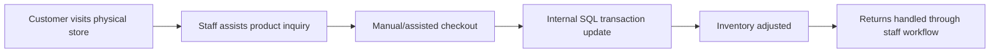
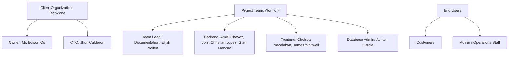
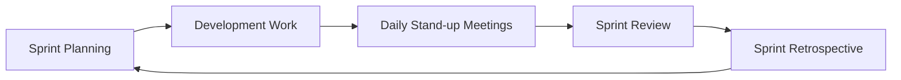
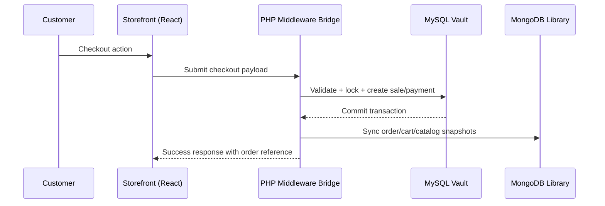
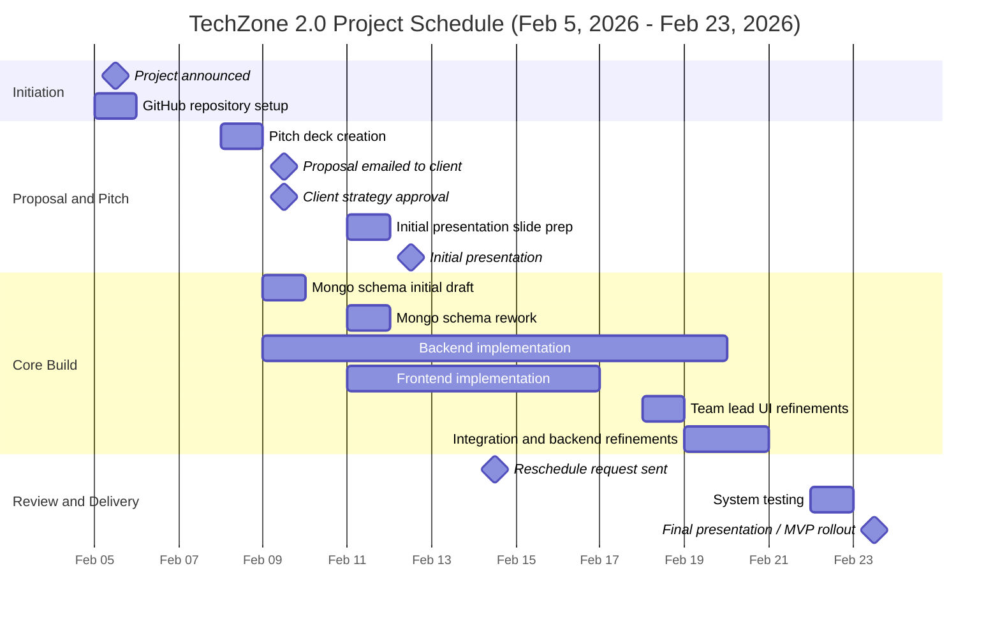
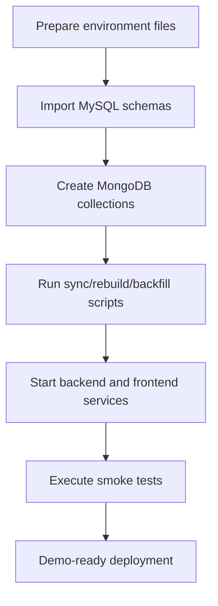

# TechZone 2.0 Project Documentation

## Cover Page
| Field | Value |
|---|---|
| Project Title | **TechZone 2.0: From Local Computer Parts Shop to Full-Scale E-Commerce Platform** |
| Client Name | **TechZone** (Owner: Mr. Edison Co, CTO: Jhun Calderon) |
| Team | **Atomic 7 (Group 1)** |
| Course | **BSCS-SF241** |
| Instructor | **Felino Calderon** |
| Project Duration | **February 5, 2026 to February 23, 2026** |
| Delivery Type | Hybrid Web Platform (Customer Storefront + Admin ERP Dashboard) |
| Documentation Version | 1.0 |
| Last Updated | February 26, 2026 |

---

## Table of Contents
- [1. Executive Summary](#1-executive-summary)
- [2. Project Description](#2-project-description)
- [3. Background of the Study](#3-background-of-the-study)
- [4. Problem Statement](#4-problem-statement)
- [5. Project Objectives](#5-project-objectives)
- [6. Scope and Limitations](#6-scope-and-limitations)
- [7. Stakeholders](#7-stakeholders)
- [8. Development Methodology (Agile)](#8-development-methodology-agile)
- [9. Project Planning](#9-project-planning)
- [10. Project Timeline (Gantt Chart)](#10-project-timeline-gantt-chart)
- [11. Sprint Documentation](#11-sprint-documentation)
- [12. Client Communication and Feedback](#12-client-communication-and-feedback)
- [13. Challenges Encountered](#13-challenges-encountered)
- [14. Solutions Implemented](#14-solutions-implemented)
- [15. Deployment Process](#15-deployment-process)
- [16. Sprint Retrospective](#16-sprint-retrospective)
- [17. Project Outcome](#17-project-outcome)
- [18. Future Enhancements](#18-future-enhancements)
- [19. Appendices](#19-appendices)

---

## 1. Executive Summary
TechZone 2.0 is the second phase of TechZone's digital transformation.  
Phase 1 established reliable SQL-based back-office operations (sales, returns, and inventory integrity).  
Phase 2 expands this foundation into a customer-facing e-commerce platform that can operate beyond physical store hours.

The team implemented a dual-database strategy:
- **MySQL ("Vault")** for strict transactional accuracy, financial truth, and inventory integrity.
- **MongoDB ("Library")** for fast, flexible, content-rich online experiences such as catalog, carts, order snapshots, and operational logs.

Project delivery was successful within the revised presentation schedule, with known minor gaps due to time constraints.

---

## 2. Project Description
### 2.1 What the Project Is
TechZone 2.0 is a hybrid commerce platform that upgrades TechZone from a store-centered operating model into a connected digital retail system with two coordinated surfaces:
1. A customer storefront for account creation, product discovery, cart and checkout, return requests, and support inquiries.
2. An admin operations dashboard for product governance, order handling, supplier administration, inventory visibility, and return/refund workflows.

Instead of replacing TechZone's existing transactional foundation, the project extends it. MySQL remains the financial and inventory source of truth, while MongoDB provides high-speed, flexible document models for read-heavy online experiences.

From an architecture standpoint, the project is a synchronization-centric system:
- Frontend: React/TypeScript storefront and admin interface.
- Middleware: PHP transaction bridge and API orchestration.
- Data layer: MySQL ("Vault") + MongoDB ("Library").

This design enables online scale while preserving business-grade consistency for sales, stock, and payment records.

### 2.2 Why It Was Developed
The project was developed because TechZone had already digitized internal operations but still depended on a physical selling window. The core strategic need was to move from "operationally stable" to "commercially scalable."

Primary reasons for development:
1. Extend revenue opportunity beyond store hours through 24/7 online availability.
2. Expand market reach beyond location-bound walk-in traffic.
3. Preserve financial and inventory integrity while introducing online ordering.
4. Provide a modern customer journey without compromising back-office control.
5. Build a realistic MVP that can be demonstrated, tested, and iterated rapidly under project time constraints.

### 2.3 Who Will Use It
| User Group | Primary Use |
|---|---|
| Store Customers | Browse products, add to cart, checkout, submit returns/inquiries, write reviews |
| Admin/Operations Staff | Manage catalog, stock, orders, returns, suppliers, and customer concerns |
| Management/Owner | Monitor business activity through dashboard and operational logs |
| Technical Team | Maintain integrations, schemas, and deployment scripts |

---

## 3. Background of the Study
### 3.1 Situation Before TechZone 2.0
Before TechZone 2.0, TechZone already had a solid SQL-driven internal operations layer for sales, returns, and inventory control.  
This gave the business strong transactional discipline, but customer acquisition and order intake were still constrained by physical store mechanics.

In short:
- Internal control was strong.
- Customer digital reach was limited.
- Growth potential was capped by offline interaction windows.

### 3.2 Current Business Process of TechZone (Before Expansion)

Process characteristics before expansion:
1. Customer discovery and checkout were largely staff-mediated.
2. Transaction posting was reliable but storefront access was not continuously available.
3. Rich online catalog behavior (high-volume specs/media/review reads) was not a primary design target in the old model.

### 3.3 Existing Problems
1. Limited selling window due to store hours and location.
2. No direct nationwide storefront channel.
3. Customer-facing experience lacked online self-service.
4. Rich product content delivery was constrained by rigid relational structures.
5. Scaling read-heavy catalog experiences directly from core transactional schema could create performance pressure.
6. Support and return initiation were more dependent on manual coordination than customer self-service.
7. Logging and analytics depth needed better focus and prioritization for MVP.

### 3.4 Need for TechZone 2.0
TechZone needed an architecture that enables:
- **Expansion**: Local shop to nationwide digital reach.
- **Integrity**: ACID-safe inventory and financial records.
- **Performance**: Fast catalog and customer interaction workflows.
- **Operational continuity**: Keep internal controls while adding online customer capability.
- **Incremental delivery**: Ship an MVP quickly while retaining a clear roadmap for deferred features.

---

## 4. Problem Statement
TechZone needed to launch a customer-facing e-commerce capability without weakening the operational reliability already established in its SQL-based internal system.  
The central challenge was not only "build a website," but "build a website that does not break the business rules of sales, stock, returns, and accountability."

Business problems addressed by this project:
1. TechZone had no always-on digital storefront for customer self-service purchasing.
2. Manual/store-dependent processes limited customer reach and sales continuity.
3. Scaling product content reads through purely relational structures risked performance bottlenecks.
4. Online order capture required strict safeguards against overselling and inconsistent inventory state.
5. Returns/refunds needed controlled lifecycle handling with auditable outcomes.
6. Stakeholder expectations demanded practical logging and analytics within an aggressive timeline.
7. The project had to deliver demonstrable MVP value by the final presentation schedule after timeline adjustment.

---

## 5. Project Objectives
### 5.1 General Objective
To design, build, and deliver TechZone 2.0 as a reliable hybrid e-commerce platform that expands TechZone from local store operations into a scalable, always-available digital commerce model while maintaining transactional correctness and operational traceability.

### 5.2 Specific Objectives
1. Implement secure customer onboarding and authentication flows aligned with available MVP constraints.
2. Deliver a usable storefront for catalog browsing, cart operations, and checkout.
3. Build a functional admin dashboard for catalog, order, inventory, supplier, and return/refund operations.
4. Keep MySQL as the authoritative ledger for sales, stock movement, and payment-linked records.
5. Use MongoDB collections to support high-read customer-facing experiences and operational document snapshots.
6. Implement middleware synchronization flows to keep transactional and document layers consistent.
7. Extend the existing SQL model with required entities (`payment`, `credit_history`, `refund_payment`) to support e-commerce workflows.
8. Provide operational logging and practical analytics sufficient for MVP decision-making.
9. Validate core business-critical flows through sprint-based QA before final presentation.
10. Deliver a stable MVP by February 23, 2026, with documented known limitations and enhancement roadmap.

---

## 6. Scope and Limitations
### 6.1 In Scope (Implemented in MVP)
| Domain | Feature | Detailed Description | Business Value |
|---|---|---|---|
| Customer Access | Registration and Login | Customer account creation with verification checks, login/session flow, and account profile actions. | Enables secure self-service entry to storefront functions. |
| Product Discovery | Catalog Browsing | Product listing and display model designed for rich content and fast retrieval from document layer. | Improves product discovery speed and browsing quality. |
| Cart and Checkout | Cart Management + Checkout Submission | Add/update/remove cart items, selected-item checkout, and transactional handoff to SQL order/payment flow. | Converts browsing activity into validated sales transactions. |
| Orders | Customer/Admin Order State Handling | Admin and customer status actions aligned to controlled order transitions. | Keeps fulfillment flow consistent and auditable. |
| Returns and Refunds | Return Request + Admin Return Processing | Customer return submission and admin evaluation/finalization with refund/store-credit outcomes. | Standardizes after-sales service and financial closure. |
| Support | Customer Inquiry Workflow | Customers submit concerns; admin can review and respond. | Centralizes support communication in-system. |
| Admin Operations | Product/Supplier/Inventory Views | Core admin tools for catalog maintenance, supplier linkage, and inventory-related operations. | Supports day-to-day operational governance. |
| Data Architecture | Hybrid SQL + MongoDB | MySQL for strict transactional truth; MongoDB for fast, flexible operational documents. | Balances consistency and performance at MVP scale. |
| Logging | Practical Audit Logs | Implemented key admin/customer audit records relevant to current MVP operations. | Provides baseline traceability for critical actions. |
| Integration Ops | Sync/Rebuild/Backfill Scripts | Operational scripts for catalog sync, order/return document rebuild, and historical data completion. | Improves consistency and recoverability across data layers. |

### 6.2 Out of Scope (Not Included in This Project)
| Excluded Feature | What It Means | Why Excluded in MVP |
|---|---|---|
| Forgot Password | No reset-by-email/OTP recovery flow in this release. | Timebox prioritized core transaction and integration stability. |
| Advanced Order Tracking | No full courier-grade live tracking dashboard for customers. | MVP focused on core order lifecycle rather than advanced tracking UX. |
| External Payment Gateway | No live third-party online payment provider integration. | Scope focused on foundational payment recording logic first. |
| Multiple Saved Addresses | Customer cannot store/select multiple delivery addresses yet. | Deferred due timeline and data model/UI complexity trade-offs. |
| Build-your-own-PC Module | No configurator for compatibility-driven component assembly. | Considered advanced merchandising feature beyond MVP baseline. |
| Fine-grained Admin RBAC | No deep module-level permission matrix in admin dashboard. | MVP used simpler role handling to meet schedule. |
| Detailed Analytics Suite | No clickstream-grade metrics (for example most-clicked product). | Kept analytics to practical operational level for delivery feasibility. |

### 6.3 Scope Clarification
Feedback requested broader logs and deeper analytics.  
The project intentionally implemented **critical operational logs and essential analytics only**, balancing timeline and MVP stability.

---

## 7. Stakeholders
### 7.1 Stakeholder Map

### 7.2 Stakeholder Responsibilities
| Stakeholder | Role in Project |
|---|---|
| Client (Owner + CTO) | Approvals, architectural direction, presentation feedback |
| Atomic 7 Team | Design, development, integration, testing, documentation |
| End Users | Operational use of storefront and admin dashboard |

---

## 8. Development Methodology (Agile)
The team followed an Agile sprint cycle with short iterations and continuous integration/refinement.

### 8.1 Agile Cycle Used

### 8.2 How Agile Was Applied in This Project
1. Sprint planning defined priority features and sprint goals.
2. Development ran in parallel streams: backend, frontend, and database.
3. Daily stand-up style updates were used for blockers, progress, and reassignments.
4. Sprint reviews aligned progress with client expectations and timeline milestones.
5. Retrospectives drove immediate improvements in the next sprint.
6. Database schema evolved every other sprint as integration realities emerged.

### 8.3 Technical Workflow

---

## 9. Project Planning
### 9.1 Preparation Phase Summary
The preparation phase started with proposal creation, repository setup, architectural framing, and early UI prototyping before full coding sprint execution.

### 9.2 Team Responsibilities
| Role | Members | Primary Responsibilities |
|---|---|---|
| Team Lead / Documentation | Elijah Nollen | Coordination, documentation, architecture communication, integration/refinement |
| Backend Developers | Amiel Chavez, John Christian Lopez, Gian Mandac | API logic, workflow enforcement, server-side validations |
| Frontend Developers | Chelsea Nacalaban, James Whitwell | Storefront and admin UI implementation |
| Database Administrator | Ashton Garcia | MongoDB schema drafting, catalog dummy details support |

### 9.3 Tools Used
| Area | Tools |
|---|---|
| Version Control | GitHub repository |
| Backend | PHP (middleware/controllers/services) |
| Frontend | React, TypeScript, TailwindCSS |
| SQL Database | MySQL |
| Document Database | MongoDB |
| API/QA | Bruno, Postman, manual API tests, and system walkthrough testing |
| Documentation | Markdown and presentation decks |

### 9.4 Development Environment
| Component | Environment |
|---|---|
| Web stack | Local XAMPP-like environment |
| Backend path | `backend/public/index.php` |
| Frontend runtime | Vite development server |
| SQL schema | Existing TechZone SQL foundation + extensions |
| Mongo collections | `admin_audit_log`, `customer_audit_log`, `customer_inquiry`, `order`, `product_catalog`, `product_review`, `return_request`, `shopping_cart` |

### 9.5 Task Allocation Log
The table below records role-level and member-level assignments.  

| Member | Role | Task / Output | Date | Sprint / Phase |
|-|-|---|---|---|
| Elijah Nollen | Team Lead / Documentation | Created GitHub repository | Feb 5 | Sprint 0 - Initiation |
| Elijah Nollen | Team Lead / Documentation | Created pitch deck | Feb 8 | Sprint 0 - Proposal |
| Elijah Nollen | Team Lead / Documentation | Co-designed UI prototype (admin + storefront) | Feb 8 to Feb 11 | Sprint 0 to Sprint 1 |
| James Whitwell | Frontend Developer | Co-designed UI prototype (admin + storefront) | Feb 8 to Feb 11 | Sprint 0 to Sprint 1 |
| Chelsea Nacalaban | Frontend Developer | Co-designed UI prototype (admin + storefront) | Feb 8 to Feb 11 | Sprint 0 to Sprint 1 |
| Elijah Nollen | Team Lead / Documentation | Sent pitch deck to client via email | Feb 9 | Sprint 1 - Client Communication |
|| | Approved strategy and requested technical implementation review focus | Feb 9 | Sprint 1 - Governance |
| Ashton Garcia | Database Administrator | Created initial MongoDB schemas | Feb 9 | Sprint 1 - DB Design |
| Amiel Chavez | Backend Developer | Implemented backend features and API logic | Feb 9 to Feb 19 | Sprint 1 to Sprint 3 |
| John Christian Lopez | Backend Developer | Implemented backend features and API logic | Feb 9 to Feb 19 | Sprint 1 to Sprint 3 |
| Gian Mandac | Backend Developer | Implemented backend features and API logic | Feb 9 to Feb 19 | Sprint 1 to Sprint 3 |
| Elijah Nollen | Team Lead / Documentation | Created initial presentation slides | Feb 11 | Sprint 1 - Presentation Prep |
| Elijah Nollen | Team Lead / Documentation | Reworked MongoDB schema after initial errors | Feb 11 | Sprint 1 - DB Validation |
| Chelsea Nacalaban | Frontend Developer | Developed frontend features (customer/admin views) | Feb 11 to Feb 16 | Sprint 2 |
| James Whitwell | Frontend Developer | Developed frontend features (customer/admin views) | Feb 11 to Feb 16 | Sprint 2 |
| Ashton Garcia | Database Administrator | Prepared product catalog dummy details | Feb 13 to Feb 19 | Sprint 2 |
| Elijah Nollen | Team Lead / Documentation | Emailed client to reschedule final presentation to Feb 23 | Feb 14 | Sprint 2 - Planning Update |
| Elijah Nollen | Team Lead / Integration | Refined frontend and added missing UI features | Feb 18 | Sprint 3 - Hardening |
| Gian Mandac, Elijah Nollen, John Christian Lopez | Backend / Integration | Combined/refined backend logic and connected DB + UI | Feb 19 to Feb 20 | Sprint 3 - Integration |
| Elijah Nollen | Database / Backend Support | Added SQL tables: `payment`, `credit_history`, `refund_payment` | Feb 19 to Feb 20 | Sprint 3 - Integration |
| Elijah Nollen | Database / Integration | Set up MongoDB runtime collections and sync flow | Feb 19 to Feb 20 | Sprint 3 - Integration |
| Chelsea Nacalaban, Amiel Chavez | Database Analysis / Documentation Support | Reverse-engineered the ERD from implemented schema | Feb 20 | Sprint 3 - Integration |
| Elijah Nollen, Amiel Chavez, John Christian Lopez, Gian Mandac, James Whitwell, Chelsea Nacalaban | QA | Participated in system testing | Feb 22 | Sprint 4 - QA |

---

## 10. Project Timeline (Gantt Chart)

### 10.1 Timeline Notes
1. Original deadline was February 19; final presentation moved to February 23 after formal email communication.
2. Integration and quality checks consumed the final days before delivery.

---

## 11. Sprint Documentation
### 11.1 Sprint Cadence Pattern (Applied Each Sprint)
| Ceremony | Applied Pattern |
|---|---|
| Sprint Planning | Decide features, assign owners, define done criteria |
| Development Work | Build backend/frontend/database deliverables |
| Daily Stand-up Meetings | Share daily progress, blockers, and dependency updates |
| Sprint Review | Demonstrate working increments to team/client stakeholders |
| Sprint Retrospective | Capture lessons and refine next sprint process |

### 11.2 Sprint Summary Table
| Sprint | Duration | Theme | Major Deliverables |
|---|---|---|---|
| Sprint 0 | Feb 5 to Feb 8 | Inception and planning | Repo, pitch direction, responsibilities, initial prototype planning |
| Sprint 1 | Feb 9 to Feb 12 | Architecture and validation | Proposal approval, initial presentation, Mongo schema baseline/rework, feature framing |
| Sprint 2 | Feb 13 to Feb 16 | Core build | Backend and frontend implementation of MVP features |
| Sprint 3 | Feb 17 to Feb 20 | Integration and hardening | UI refinements, backend logic cleanup, DB bridge stabilization |
| Sprint 4 | Feb 21 to Feb 23 | QA and delivery | Testing, defect fixes, final presentation rollout |

### 11.3 Sprint 0 - Inception and Planning
| Item | Details |
|---|---|
| Sprint Name | Sprint 0 - Inception and Planning |
| Duration | Feb 5 to Feb 8, 2026 |
| Objectives | Establish project direction, team ownership, and proposal readiness |
| Sprint Planning | Repository initialization, role mapping, pitch storyline preparation |
| Development Work | GitHub setup; outline of hybrid architecture; UI prototype direction |
| Daily Stand-up Meetings | Progress checks on pitch tasks and prototype preparation |
| Sprint Review | Internal review of pitch quality and architecture messaging |
| Sprint Retrospective | Need tighter timeline control and earlier technical validation |
| Assigned Members | Elijah Nollen, Amiel Chavez, John Christian Lopez, Gian Mandac, Chelsea Nacalaban, James Whitwell, Ashton Garcia |
| Deliverables | Repo created; pitch deck draft; team structure finalized |

### 11.4 Sprint 1 - Architecture and Validation
| Item | Details |
|---|---|
| Sprint Name | Sprint 1 - Architecture and Validation |
| Duration | Feb 9 to Feb 12, 2026 |
| Objectives | Secure client approval and validate technical direction |
| Sprint Planning | Define SQL-Vault and Mongo-Library responsibilities |
| Development Work | Proposal sent; client approved strategy; Mongo schema draft and rework; initial presentation prep |
| Daily Stand-up Meetings | Focus on architecture coherence and presentation readiness |
| Sprint Review | Initial presentation (Feb 12) with feedback on logs/analytics depth |
| Sprint Retrospective | Improve requirement narrowing for MVP timebox |
| Assigned Members | Elijah Nollen, Ashton Garcia, Amiel Chavez, John Christian Lopez, Gian Mandac, Chelsea Nacalaban, James Whitwell |
| Deliverables | Strategy approval; initial presentation; refined database direction |

### 11.5 Sprint 2 - Core Build
| Item | Details |
|---|---|
| Sprint Name | Sprint 2 - Core Build |
| Duration | Feb 13 to Feb 16, 2026 |
| Objectives | Implement core customer/admin MVP features |
| Sprint Planning | Prioritize high-value features over advanced optional modules |
| Development Work | Backend workflow coding and frontend page implementation |
| Daily Stand-up Meetings | API integration updates, UI blockers, schema clarifications |
| Sprint Review | Internal feature walkthroughs of active increments |
| Sprint Retrospective | Additional integration pass required due cross-layer complexity |
| Assigned Members | Elijah Nollen, Amiel Chavez, John Christian Lopez, Gian Mandac, Chelsea Nacalaban, James Whitwell, Ashton Garcia |
| Deliverables | Working storefront/admin modules in MVP state |

#### Sprint 2 Feature Set (Implemented)
| Track | Features Delivered |
|---|---|
| Customer | Registration/login, product browsing, cart and checkout flow |
| Customer | Returns request creation, inquiry submission, profile actions |
| Admin | Product and supplier maintenance |
| Admin | Order and return/refund management workflows |
| Data | Mongo collections integrated for catalog/cart/order/return snapshots |

### 11.6 Sprint 3 - Integration and Hardening
| Item | Details |
|---|---|
| Sprint Name | Sprint 3 - Integration and Hardening |
| Duration | Feb 17 to Feb 20, 2026 |
| Objectives | Stabilize cross-database behavior and polish user workflows |
| Sprint Planning | Focus on middleware bridge, business rule consistency, and UI corrections |
| Development Work | Team lead added/adjusted frontend features; backend logic combing and DB/UI connection refinements |
| Daily Stand-up Meetings | Intensive bug triage and integration status checks |
| Sprint Review | Internal verification of SQL-Mongo synchronization behavior |
| Sprint Retrospective | Highlighted need for earlier QA automation in future projects |
| Assigned Members | Elijah Nollen, Amiel Chavez, John Christian Lopez, Gian Mandac, Chelsea Nacalaban, James Whitwell, Ashton Garcia |
| Deliverables | Stable synchronization and stronger workflow-level validations |

#### Sprint 3 Database Evolution
| Change | Rationale |
|---|---|
| Added `payment` table | Support sale-payment transaction lifecycle |
| Added `credit_history` table | Track store credit transactions and adjustments |
| Added `refund_payment` table | Formalize refund settlement records |
| MongoDB setup and operationalization | Enable document-side storefront operations |

### 11.7 Sprint 4 - QA and Delivery
| Item | Details |
|---|---|
| Sprint Name | Sprint 4 - QA and Delivery |
| Duration | Feb 21 to Feb 23, 2026 |
| Objectives | Validate MVP reliability and prepare final demonstration |
| Sprint Planning | Test critical flows and fix release-blocking issues |
| Development Work | System testing and final stabilization |
| Daily Stand-up Meetings | Short fix/verify loops |
| Sprint Review | Final presentation and MVP rollout |
| Sprint Retrospective | Project succeeded; minor planned features deferred due timeline |
| Assigned Members | Elijah Nollen, Amiel Chavez, John Christian Lopez, Gian Mandac, James Whitwell, Chelsea Nacalaban, Ashton Garcia |
| Deliverables | Final demonstration-ready TechZone 2.0 MVP |

### 11.8 Testing Participation Record
| Member | Testing Participation |
|---|---|
| Elijah Nollen | Active testing across sprints |
| Amiel Chavez | Active testing across sprints |
| James Whitwell | Active testing across sprints |
| Chelsea Nacalaban | Active testing across sprints |
| John Christian Lopez | Active testing across sprints |
| Gian Mandac | Active testing across sprints |
| Ashton Garcia | Did not perform full system QA validation pass |

---

## 12. Client Communication and Feedback
### 12.1 Communication Log
| Date | From | To | Subject | Outcome |
|---|---|---|---|---|
| Feb 9, 2026 | Atomic 7 (Elijah) | Mr. Edison Co | Proposal for TechZone System Expansion | Proposal submitted with hybrid architecture strategy |
| Feb 9, 2026 | Jhun Calderon (CTO) | Elijah / Atomic 7 | RE: Strategy Approved | Architecture strategy approved; moved directly to technical implementation review |
| Feb 14, 2026 | Atomic 7 (Elijah) | Jhun Calderon | Implementation Timeline for TechZone E-Commerce | Requested reschedule to Feb 23; aligned on need for added testing window |

### 12.2 Initial Presentation Feedback (Feb 12)
| Feedback | Interpretation | Team Response |
|---|---|---|
| "Audit logs is broad; have all kinds of logs" | Logging scope needed prioritization | Implemented operationally critical logs only for MVP |
| "Have analytics" | Stakeholder requested stronger visibility metrics | Added practical analytics relevant to current MVP; deferred advanced analytics |

### 12.3 Final Presentation Comments (Feb 23)
| Comment | Status |
|---|---|
| MongoDB collections do not use FK-like links | Accepted as document-model behavior; consistency managed by middleware and SQL source-of-truth design |
| Back arrow in UI redundant with logo navigation | Identified as UI cleanup item |
| Need multiple saved addresses per customer | Deferred to future enhancement |
| Need more detailed admin inventory logs (who changed what) | Partially addressed; deeper granularity planned as future enhancement |

### 12.4 Internal Team Feedback
| Feedback | Action |
|---|---|
| Add deeper analytics (for example, most-clicked product) | Deferred to future roadmap |
| Improve QA participation consistency across members | Recorded as process improvement for next project cycle |
| Make documentation longer and more structured | Implemented in this report and companion technical documentation |

---

## 13. Challenges Encountered
| Challenge | Impact |
|---|---|
| Tight timeline between approval and final rollout | Required strict MVP prioritization and trade-offs |
| Hybrid database synchronization complexity | Increased integration overhead and retesting cycles |
| Evolving requirements after presentations | Required scope control and staged delivery decisions |
| Schema corrections mid-development | Rework effort on Mongo model consistency |
| Uneven QA execution across team | Increased burden on active testers near release window |

---

## 14. Solutions Implemented
| Challenge Addressed | Solution |
|---|---|
| Timeline pressure | Adopted sprint-based prioritization and deferral of non-critical features |
| Sync reliability | Enforced SQL-first transactional writes with controlled Mongo sync/update scripts |
| Requirement shifts | Used review/retro checkpoints to freeze sprint scope and protect MVP |
| Schema issues | Reworked Mongo schemas and aligned collection usage with application workflows |
| QA gaps | Concentrated testing on highest-risk workflows before final presentation |

---

## 15. Deployment Process
### 15.1 Delivery Approach
The system was delivered as a locally deployable MVP stack with:
1. SQL schema import flow (legacy then new inventory schema).
2. MongoDB collection setup.
3. Backend environment configuration.
4. Frontend runtime setup.
5. Post-import sync/rebuild/backfill script execution.

### 15.2 Deployment Workflow

### 15.3 Handover Artifacts
| Artifact | Purpose |
|---|---|
| Application + backend/frontend source | Core product delivery |
| SQL scripts | Schema and data setup |
| Mongo schema/collection setup guidance | Document-side setup |
| Maintenance scripts | Data synchronization and consistency maintenance |
| Documentation set | Operational, technical, and project-level guidance |

---

## 16. Sprint Retrospective
### 16.1 What Went Well
1. Client strategy approval was achieved quickly.
2. Architecture direction remained consistent with stakeholder goals.
3. Core MVP features were delivered by final presentation date.
4. Team lead integration work resolved cross-layer inconsistencies before final demo.

### 16.2 What Problems Occurred
1. Compressed timeline reduced depth for advanced features.
2. Midstream schema adjustments required rework.
3. QA participation was inconsistent across team members.
4. Some requested enhancements could not be completed in the MVP window.

### 16.3 What Improvements Were Made Sprint-to-Sprint
1. Better feature prioritization from "nice-to-have" to "must-have".
2. Stronger synchronization checks and script-based consistency support.
3. Improved documentation quality and traceability.
4. Clearer distinction between in-scope MVP and future roadmap features.

---

## 17. Project Outcome
### 17.1 Delivery Result
The project outcome is **successful**, with minor known gaps due to time constraints.

### 17.2 Business Value Delivered
1. TechZone now has a functional digital commerce foundation.
2. Existing operational trust in SQL remained intact.
3. MongoDB improved flexibility and responsiveness for customer-facing data.
4. Admin operations can handle online workflows with better structure and traceability.

### 17.3 Residual Gaps
1. Advanced analytics depth remains limited.
2. Multiple address management is not yet available.
3. Some UI/UX refinements identified in final review remain open.

---

## 18. Future Enhancements
### 18.1 Prioritized Enhancement Backlog
| Priority | Enhancement | Business Benefit |
|---|---|---|
| High | Forgot password and account recovery UX | Reduce support burden and account access friction |
| High | Multiple saved addresses | Faster checkout and better customer convenience |
| High | Enhanced admin inventory audit trail | Stronger accountability for stock edits/sales actions |
| Medium | External payment gateway integration | Better payment convenience and conversion |
| Medium | Advanced order tracking | Higher customer visibility post-checkout |
| Medium | Granular RBAC for admin dashboard | Better operational security segregation |
| Medium | Detailed analytics (including clickstream) | Better merchandising and conversion optimization |
| Low | Build-your-own-PC configurator | Differentiated customer experience for enthusiasts |

### 18.2 Recommended Next Release Strategy
1. Release 2.1: account recovery + multi-address + inventory audit improvements.
2. Release 2.2: payment gateway and advanced order tracking.
3. Release 2.3: analytics expansion and optional BYOPC module.

---

## 19. Appendices
### Appendix A - Team Composition (Atomic 7)
| Functional Group | Members |
|---|---|
| Backend Developers | Amiel Chavez, John Christian Lopez, Gian Mandac |
| Frontend Developers | Chelsea Nacalaban, James Whitwell |
| Database Administrator | Ashton Garcia |
| Team Lead / Documentation | Elijah Nollen |

### Appendix B - MongoDB Collections in Project
1. `admin_audit_log`
2. `customer_audit_log`
3. `customer_inquiry`
4. `order`
5. `product_catalog`
6. `product_review`
7. `return_request`
8. `shopping_cart`

### Appendix C - Client Email Communication (Full Record)
#### C1
| Field | Details |
|---|---|
| Email ID | C1 |
| Date | Feb 9, 2026 |
| Subject | Proposal for TechZone System Expansion |
| From | Atomic 7 (Group 1) |
| To | Mr. Edison Co (Owner, TechZone) |
| Message | Dear Mr. Co,  I hope you are doing well.  It has been some time since we completed TechZone's database system, and we would like to check in on how the transition has been for you and your staff. Has the system improved how you manage sales, returns, and inventory? We would truly appreciate any feedback you may have.  With your back office now running through SQL, ensuring accurate records, transactions, and reports, we believe TechZone is ready to expand into a 24/7 E-commerce website. In simple terms, your current system works very well for managing the "store of today" and we would like to help you build the "store of tomorrow".  To support this next step, we are proposing a "Best of Both Worlds" data strategy using both SQL and MongoDB. SQL will continue to handle secure and structured business records, while MongoDB will power the website, allowing flexible and fast updates for products and online content.  If you have any thoughts about how the current system is performing, or if you agree with this new direction, please let us know. We would be happy to schedule a short meeting to discuss the details and answer any questions you may have.  Attached is the file containing the full proposal for your review. We look forward to your feedback and hope to move forward with this exciting next phase for TechZone.  Best regards, Elijah Nollen Team Lead - Atomic 7 |

#### C2
| Field | Details |
|---|---|
| Email ID | C2 |
| Date | Feb 9, 2026 |
| Subject | RE: Proposal for TechZone System Expansion - STRATEGY APPROVED |
| From | Jhun Calderon (Chief Technology Officer, TechZone) |
| To | Elijah Nollen (Team Lead, Atomic 7) |
| Message | Dear Elijah and the Atomic 7 Team,  Mr. Co forwarded your proposal for TechZone 2.0 to my desk. I have reviewed the architectural strategy outlined in your PDF.  Decision: STRATEGY APPROVED.  I am rarely impressed by initial pitches, but your "Vault vs. Library" analogy demonstrates a maturity I usually only see in senior architects. You correctly identified the critical distinction: 1. The Vault (SQL): Financial ledgers and inventory counts must be ACID compliant. We cannot afford "eventual consistency" when it comes to taxes or stock levels. 2. The Library (MongoDB): Offloading rich content (specs, photos, reviews) to a document store solves the "Sparse Data" problem inherent in electronics retail.  Next Steps: The Architecture Review. Since your strategic direction is already aligned with our goals, we can skip the preliminary "Sales Pitch" and move straight to the Technical Implementation Review. We will conduct this review on Thursday, February 12.  For the February 12 Meeting: Do not sell me on why anymore - you have already sold it. Instead, show me how. 1. The Synchronization Flow: If a user buys a laptop on the MongoDB-powered website at 11:00 PM, how does that transaction securely deduct from the SQL Inventory "Vault"? Diagram that data flow. 2. The Tech Stack: Confirm your middleware. Are you using Node.js, PHP, or Python to bridge these two worlds? 3. The MVP Plan: What specific features will be live for the final rollout on Feb 23?  You have the green light to start designing the schema immediately.  See you on Thursday.  Best regards, Jhun Calderon Chief Technology Officer - CTO TechZone |

#### C3
| Field | Details |
|---|---|
| Email ID | C3 |
| Date | Feb 14, 2026 |
| Subject | Implementation Timeline for TechZone E-Commerce |
| From | Atomic 7 (Group 1) |
| To | Jhun Calderon (Chief Technology Officer, TechZone) |
| Message | Dear Mr. Calderon,  It was a pleasure discussing the project proposal and implementation plan during our meeting last Thursday.  Following our technical review, we have finalized the development roadmap for the TechZone platform. To ensure a solid integration between our SQL inventory "Vault" and the MongoDB-powered front-end, we are proposing February 23 as the date for the final project presentation and MVP rollout.  We believe this timeline is ideal for several reasons: - It allows for thorough testing of the data synchronization between the relational and non-relational layers. - We can ensure that the SQL-based financial and inventory records are fully isolated and secure. - It provides the necessary window to verify the real-time responsiveness of the MongoDB product catalog.  Please let us know if this date aligns with your schedule. We are excited to demonstrate how this hybrid database approach will support TechZone's growth.  Best regards, Elijah Nollen Team Lead - Atomic 7 |
